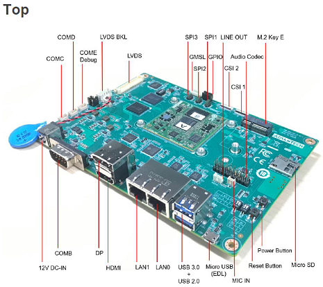
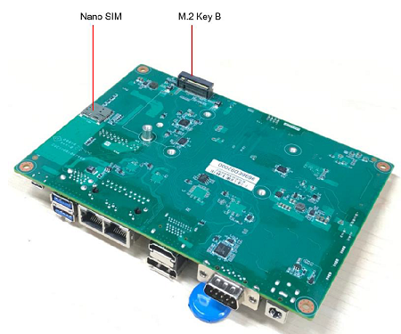
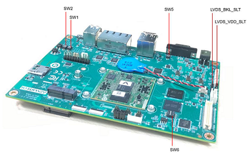

## Overview
Qualcomm QCS6490 OSM 1.1 Computer-on-Module

- Qualcomm 8 Kryo cores up to 2.7GHz
- Onboard LPDDR5 8GB, 8533MT/s memory
- Onboard 128GB UFS and 128GB eMMC
- 1x 2ch. LVDS, 1x DP and 1x HDMI for displays
- 2x USB3.2 Gen1, 2x USB2.0, 2x PCIe Gen3.0 x1, 2x 4wire UART, 1x SPI,16x GPIO, 1x I2C, 2x MIPI-CSI x4
- 1x Micro SD and 1x Nano SIM
- Support Windows 11 IoT Enterprise

## Device

