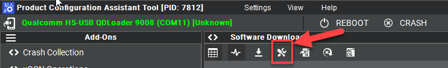
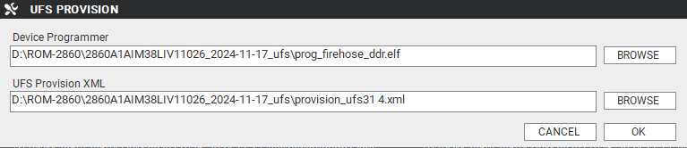
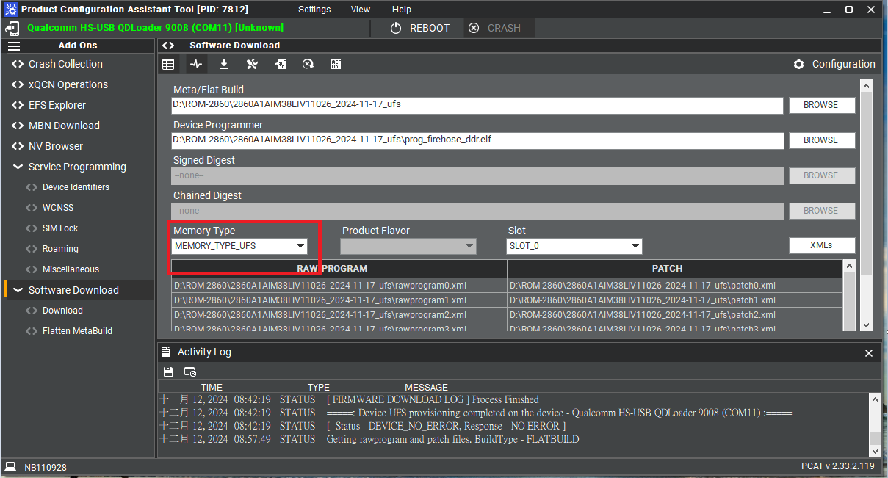
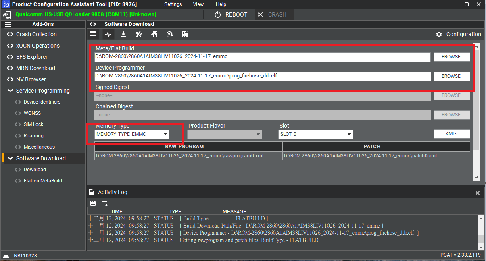

:::tip [Download The BSP Image Here](https://www.dropbox.com/scl/fo/tptbp080ohgckjdbr3vrq/AHI6QIyYpVQmGtIcHdtlRzs/officialbuild/risc_qcs_linux_yocto_00041.0/2024-11-17?rlkey=647rksjn60zyqj4i134tflsuj&e=2&subfolder_nav_tracking=1&dl=0)
Version： GA 
:::

## Overview
- Release Date: 2024/11/17
- Support Product: AOM-2721

## 1. Download and Install Required Tools
- Download Qualcomm Software Center [Link](https://softwarecenter.qualcomm.com/)
- Install and Open `Qualcomm Software Center`.
- Search for `PCAT` in the search bar.
- Select `Qualcomm® Product Configuration Assistant Tool` and install
- Search for `QUTS` in the search bar.
- Select `Qualcomm® Unified Tools Services` and install
- After install, you will find below application in your system
   - QUTSStatusApp
   - Qualcomm Software Center
   - xPCATApp
   - PCATApp

## 2. Prepare for Flashing

- Unzip the provided firmware files for both UFS and eMMC, e.g.:
  - `2860A1AIM38LIV11026_YYYY-MM-DD_ufs.tgz`
  - `2860A1AIM38LIV11026_YYYY-MM-DD_emmc.tgz`
- Use a micro USB cable to connect the device to your PC.
- If your PC does **not** recognize the device:
  1. Search for `Qualcomm USB Driver` in the Qualcomm Software Center.
  2. Download and install it.

## 3. Reformat

**For confirmation, we will erase the partition before UFS installation.** 

- Open `Product Configuration Assistant Tool` on your Windows system.
- Select provision button

- Add the prog_firehose_ddr.elf and provision_ufs31.xml in UFS  folder. 

- Press "OK", it will start to do USF Provision.

## 4. Flash UFS

- Turn on the target device power 
- Switch Boot Mode
   - **Flash UFS:** Set SW1 to 1-on, 2-on.
   - **Force Recovery:** Set SW2 to 1-on, 2-on.

- Open `PCATApp`
- Click `Connect A Device`
- Check the device `Qualcomm HS-USB QDLoader 9008 (COM11)`
- After check click `Connect` button to connect
- When you connected successfully , it will show  "qreen word" - Qualcomm HS-USB QDLoader 9008 (COM 11) 
- Select UFS Folder in PCAT Tool , the Tool will help load Files automatically and Select "MEMORY_TYPE_UFS"

- Click `Download` button
- When you finish the download process , please change the switch.
   - **Flash UFS:** Set SW1 to 1-off, 2-off.
   - **Force Recovery:** Set SW2 to 1-on, 2-on.

## 4. Flash eMMC
- Makesure the target device power off
- Switch Boot Mode
   - **Flash eMMC:** Set SW1 to 1-off, 2-on.
   - **Force Recovery:** Set SW2 to 1-on, 2-on.
- Turn on the target device power
- Open `PCATApp`
- If target device not connect
   - Click `Connect A Device`
   - Check the device `Qualcomm HS-USB QDLoader 9008 (COM11)`
   - After check click `Connect` button to connect
- Select eMMC folder , the Tool will help load Files automatically and Select "MEMORY_TYPE_UFS"

- Click `Download` button
- When the eMMC installation finished . Close the PCAT tool
- pleaes remove the mirco usb cable, turn off the target device power 
- Switch Boot Mode
   - **eMMC boot up:** Set SW1 to 1-off, 2-on.
   - **Force Recovery:** Set SW2 to 1-off, 2-off.
- Connect debug cable and open the terminal ,  turn on the power . 
- If you have done **Reformat** , the message will show `DDR: Start of DDR Training Init`
- When the systme boot up , you need to type
   - login: `root`
   - Password: `oelinux123`