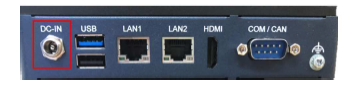
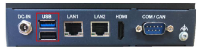
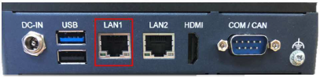
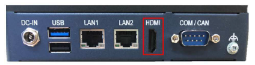
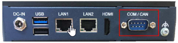

## Overview
EPC-R3720 is an ARM® Cortex®-A53 i.MX8MPlus-based secured, compact-sized, low-power consumed Edge AI Box, best for your Edge AI Inference with Neural Network Accelerator up to 2.3 TOPS, HDR-Capable ISP of 375 MPixels/s, with a wide range of I/O extension and oriented for industrial automation.

- NXP i.MX8M Plus Cortex-A53 Quad/Dual up to 1.8GHz
- On-board LPDDR4 6 GB, 4000MT/s memory
- HDMI up to 3840 x 2160 at 30Hz resolution
- Dual GbE LAN, 1 USB2.0 and 1 USB 3.2 Gen 1
- 1 Micro SD Socket & 1 Nano SIM Slot
- 1 mini-PCIe for 3G/4G, 1 M.2 2230 Key E Slot
- Yocto Linux and Android
- Five rear I/O configurations available for different requirements

## Connector List
### DC-In
EPC-R7300 support a lockable DC two pole terminal block that can be connected 9-24 DC external power input

| Pin | Pin Name |Pin | Pin Name |
|-----|-------------|-----|-------------|
| 1   | +12V   | 2   | GND              |
| 3   | GND    |     |                  |

### USB Ports
EPC-R7300 supports 1 * USB3.2 Gen 1 by 1 Type A ports and 1 * USB2.0.Type A ports on the front side, which are Host.

| Pin | Pin Name     | Pin | Pin Name     |
|-----|--------------|-----|--------------|
| 1   | +VBUS_USB5   | 2   | USB1_D-      |
| 3   | USB5_D+      | 4   | GND          |
| 5   | USB5_SSRX-   | 6   | USB1_SSRX+   |
| 7   | GND          | 8   | USB1_SSTX-   |
| 9   | USB5_SSTX+   | 10  | +VBUS_USB6   |
| 11  | USB6_D-      | 12  | USB6_D+      |
| 13  | GND          |     |              |
| H1  | GND          | H2  | GND          |
| H3  | GND          | H4  | GND          |

### LAN Ports
EPC-R3720 supports 2 * 10/100/1000Mbps LAN ports on the front side.

#### LAN 1 / LAN 2

| Pin | Pin Name         | Pin | Pin Name           |
|-----|------------------|-----|--------------------|
| 1   | LAN1_MDIO+       | 2   | LAN1_MDIO-         |
| 3   | LAN1_MDI1+       | 4   | LAN1_MDI1-         |
| 5   | GND              | 6   | GND                |
| 7   | LAN1_MDI2+       | 8   | LAN1_MDI2-         |
| 9   | LAN1_MDI3+       | 10  | LAN1_MDI3-         |
| 11  | LAN1_ACT#        | 12  | +2.5V_VDDH1        |
| 13  | LAN1_LED_1000#   | 14  | LAN1_LED_10_100#   |

### HDMI
EPC-R3720 supports 1 HDMI 2.0 , for up to 3840 * 2160 resolution at 30Hz.

| Pin | Pin Name             | Pin | Pin Name              |
|-----|----------------------|-----|-----------------------|
| 1   | HDMI_TD2+            | 2   | GND                   |
| 3   | HDMI_TD2-            | 4   | HDMI_TD1+             |
| 5   | GND                  | 6   | HDMI_TD1-             |
| 7   | HDMI_TD0+            | 8   | GND                   |
| 9   | HDMI_TD0-            | 10  | HDMI_CLK+             |
| 11  | GND                  | 12  | HDMI_CLK-             |
| 13  | HDMI_CEC             | 14  | HDMI_Utility/eARC+    |
| 15  | HDMI_DDC_SCL         | 16  | HDMI_DDC_SDA          |
| 17  | GND                  | 18  | +5V                   |
| 19  | HDMI_HPD/eARC-       |     |                       |

### COM/CAN
EPC-R3720 supports 1 * DB9 port at the front side which is default used as debug console, but can be configured as RS-232/RS-422/RS-485, and also with 1 * CAN-FD signal.

| Pin | RS-232 (Default used as Debug Console) | RS-422         | RS-485         | CAN-FD   |
|-----|----------------------------------------|----------------|----------------|----------|
| 1   | COM_DCD                                | RS-422_TXD-    | RS-485_D-      | -        |
| 2   | COM_RXD                                | RS-422_TXD+    | RS-485_D+      | -        |
| 3   | COM_TXD                                | RS-422_RXD+    | -              | -        |
| 4   | COM_DTR                                | RS-422_RXD-    | -              | -        |
| 5   | GND                                    | GND            | GND            | -        |
| 6   | -                                      | -              | -              | CAN1_H   |
| 7   | COM_RTS                                | -              | -              | -        |
| 8   | COM_CTS                                | -              | -              | -        |
| 9   | -                                      | -              | -              | CAN1_L   |

