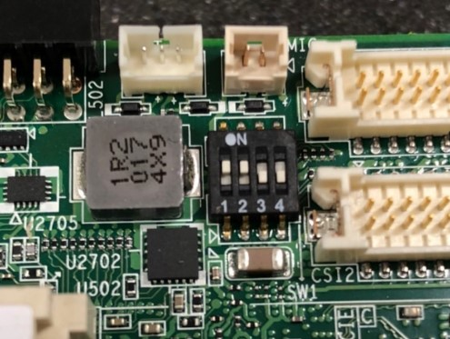
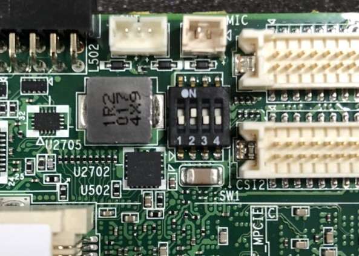

:::tip [Download The BSP Image Here](https://www.dropbox.com/scl/fo/f34djgmjfo1tpk0x1olf3/h?rlkey=dxpi3vzwru8pp6hrxn6vh5vrp&e=1&dl=0)
Folder：2023-06-14
<br/>Version： Alpha
<br/>Test Report：[Link](https://ess-wiki.advantech.com.tw/wiki/images/9/9b/Test_Report_Yocto_4_0_RSB-3720_2G_Version_C0047.xlsx)
:::

## Overview
- Release Date: 2023/06/14
- Support Product: EPC-R3720

## Release Note

| Item             | Description                   |
|------------------|-------------------------------|
| Uboot version    | v2022.04_5.15.52_2.1.0        |
| Kernel version   | 5.15.52_2.1.0                 |
| QT               | 6                             |
| Open CV          | 4.6.0                         |
| Tensorflow-lite  | 2.9.1                         |
| Onnxruntime      | 1.10.0                        |
| nn-imx           | 1.3.0（Arm NN removed）        |
| GStreamer        | 1.20.0                        |
| Chromium         | 91.0.4472.114                 |

## Change Log

| Item | Change List   | Description                  |
|------|--------------|-----------------------------|
| 1    | New Feature   | Full Function Test ready     |
| 2    | Known Issue   | none                        |


## SD Card Boot / eMMC Flash 

### Option 1: Booting Directly from SD Card

1. **Identify SD Card Device**
   - Insert the SD card into your Ubuntu host.
   - Use `sudo fdisk -l` to find the device path (e.g., `/dev/sdf`).

2. **Flash Image to SD Card**
   - Run:
     ```
     sudo dd if=your_image.img of=/dev/sdX bs=1M conv=fsync
     ```
     Replace `your_image.img` and `/dev/sdX` with your actual image file and SD card device.
     Find in the Dropbox, it can be below:
     - 3720A1AIM34LIVC0047_iMX8MP_2G_2023-06-14.img
     - 3720A1AIM34LIVC0047_iMX8MP_6G_2023-06-14.img

3. **Insert SD Card into Target Device**

4. **Set Boot Switch to SD Card Mode**
   - Check the SW1 1 and 2 on

   

5. **Connect Serial Terminal**
   - Use a terminal tool (e.g., Tera Term).
   - Tera Term Settings:
   
   | Setting       | Value  |
   |---------------|--------|
   | Baud Rate     | 115200 |
   | Data          | 8      |
   | Parity        | none   |
   | Stop          | 1 bit  |
   | Flow Control  | none   |

6. **Power On and Boot**
   - Observe boot messages from the SD card.

### Option 2: Flashing Image to eMMC (via SD Card Boot)

**Preparation:**  
First, complete the SD card boot process as described above.

1. **Copy the eMMC Flash Tool to a USB Drive**
   - Place the flash tool archive (e.g., `xxx_flash_tool.tgz`) on a USB stick.
   - Find in the Dropbox, it can be below:
      - 3720A1AIM34LIVC0047_iMX8MP_2G_flash_tool.tgz
      - 3720A1AIM34LIVC0047_iMX8MP_6G_flash_tool.tgz

2. **Boot the Device from SD Card**
   - Insert the SD card and boot into Linux.

3. **Insert USB Drive into Target Device**

4. **Locate the USB Drive in Linux**
   - For example: `/run/media`
   - Verify with `ls` command.
   - You should find `sda1`

5. **Copy the Flash Tool to Root Directory**
   ```
   sudo cp -a /run/media/sda1/xxx_flash_tool.tgz /
   ```

6. **Extract the Flash Tool**
   ```
   cd /
   tar -xvf xxx_flash_tool.tgz
   ```

7. **Run the eMMC Flash Script**
   ```
   cd /xxx_flash_tool/mk_inand/
   ./mksd-linux.sh /dev/mmcblk2
   ```
   - `/dev/mmcblk2` is typically the eMMC device.
   - Confirm when prompted to erase eMMC.

8. **After Flashing, Remove SD Card and Set Boot Switch to eMMC Mode**
   - Check the SW1 2 on

   

9. **Reboot and Boot from eMMC**
   - Observe boot messages to confirm eMMC boot.

### Summary Table

| Step                | SD Card Boot                   | eMMC Flashing                    |
|---------------------|-------------------------------|----------------------------------|
| Make Boot Media     | SD card image                 | Start from SD card boot          |
| Boot Mode Switch    | Set to SD card mode           | Set to SD card mode              |
| Boot System         | From SD card                  | From SD card                     |
| Flashing Process    | N/A                           | Copy & run eMMC flash script     |
| Switch After Flash  | N/A                           | Set to eMMC mode, remove SD card |
| Final Boot Medium   | SD card                       | eMMC                             |