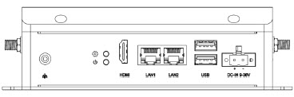
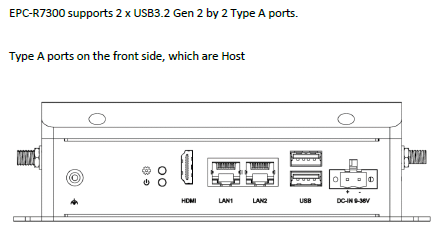
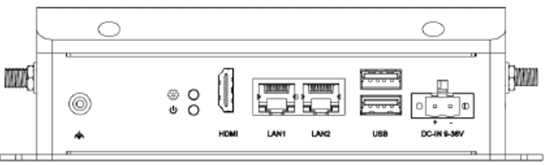
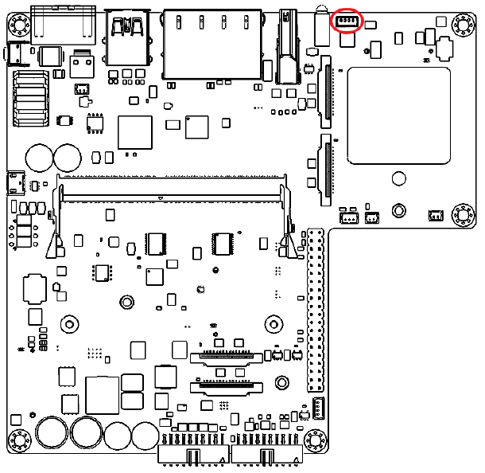
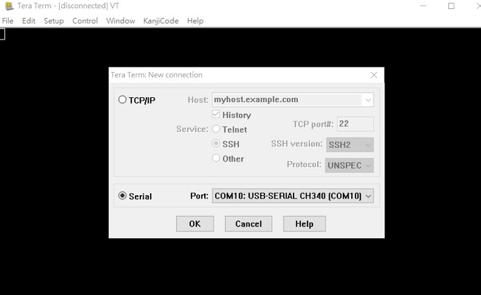
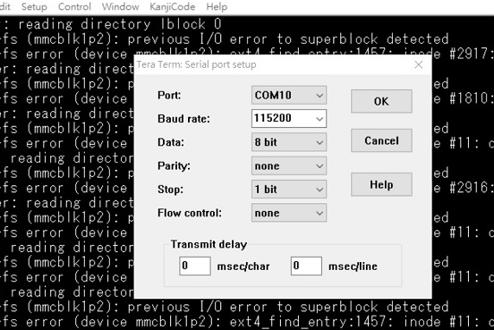

## Overview
EPC-R7300 ,An industrial barebones PC for the NVIDIA® Jetson Orin™ NX and Jetson Orin™ Nano systems-on-modules delivers 20–100 TOPS of AI performance.

- NVIDIA Jetson Orin™ Nano and NX Module compatible Barebone PC
- Industrial and Expandable Design
- HDMI up to 3840 x 2160 at 60Hz resolution
- Dual GbE LAN,  2 USB3.2 Gen 2
- 1 Nano SIM Slot
- 1 M.2 3042/52 Key B Slot, 1 M.2 2230 Key E Slot, 1 M.2 2280 Key M Slot
- 4 Kinds of Rear I/O for Each Vertical Focus: IEM, Self Service, Automation and Networking

## Pin defination
### DC-In
EPC-R7300 support a lockable DC two pole terminal block that can be connected 9-24 DC external power input



| Pin | Pin Name |Pin | Pin Name |
|-----|-------------|-----|-------------|
| 1   | +9-36V DC   | 2   | GND         |

### USB Ports
EPC-R7300 supports 2 * USB3.2 Gen 2 by 2 Type A ports.Type A ports on the front side, which are Host.


| Pin | Pin Name     | Pin | Pin Name     |
|-----|--------------|-----|--------------|
| 1   | +VBUS_1      | 2   | USB1_D-      |
| 3   | USB1_D+      | 4   | GND          |
| 5   | USB1_SSRX-   | 6   | USB1_SSRX+   |
| 7   | GND          | 8   | USB1_SSTX-   |
| 9   | USB1_SSTX+   |     |              |
| 10  | +VBUS_2      | 11  | USB2_D-      |
| 12  | USB2_D+      | 13  | GND          |
| 14  | USB2_SSRX-   | 15  | USB2_SSRX+   |
| 16  | GND          | 17  | USB2_SSTX-   |
| 18  | USB2_SSTX+   |     |              |

### LAN Ports
EPC-R7300 supports 2 * 10/100/1000Mbps LAN ports on the front side.


#### LAN 1 is the Ethernet function from Intel 1225 PCIE to GbE.

| Pin | Pin Name    | Pin | Pin Name    |
|-----|-------------|-----|-------------|
| 1   | LAN1_DA+    | 2   | LAN1_DA-    |
| 3   | LAN1_DB+    | 4   | LAN1_DC+    |
| 5   | LAN1_DC-    | 6   | LAN1_DB-    |
| 7   | LAN1_DD+    | 8   | LAN1_DD-    |
| LED-L | Green : Activity | LED-R | GREEN: 1000M LINK <br/> AMBER: 100M LINK | 

#### LAN 2 is the Ethernet function from NVIDIA Jetson integrated RGM.

| Pin | Pin Name    | Pin | Pin Name    |
|-----|-------------|-----|-------------|
| 1   | LAN2_DA+    | 2   | LAN2_DA-    |
| 3   | LAN2_DB+    | 4   | LAN2_DC+    |
| 5   | LAN2_DC-    | 6   | LAN2_DB-    |
| 7   | LAN2_DD+    | 8   | LAN2_DD-    |
| LED-L | Green : Activity | LED-R | GREEN: 1000M LINK<br/>AMBER: 100M LINK | 

### HDMI
EPC-R7300 supports 1 HDMI 2.0 , for up to 3740 * 2160 resolution at 60Hz.


| Pin | Pin Name       | Pin | Pin Name       |
|-----|----------------|-----|----------------|
| 1   | HDMI_TD2+      | 2   | GND            |
| 3   | HDMI_TD2-      | 4   | HDMI_TD1+      |
| 5   | GND            | 6   | HDMI_TD1-      |
| 7   | HDMI_TD0+      | 8   | GND            |
| 9   | HDMI_TD0-      | 10  | HDMI_CLK+      |
| 11  | GND            | 12  | HDMI_CLK-      |
| 13  | HDMI_CEC       | 14  | N/A            |
| 15  | HDMI_DDC_SCL   | 16  | HDMI_DDC_SDA   |
| 17  | GND            | 18  | +5V            |
| 19  | HDMI_HPD       |     |                |

## Debug
### Debug Port
EPC-R7300 provides one Debug Port for development used. Debug cable P/N: 1700021565-01 4P-1.25 to D-SUB 9P (F) 60cm


| Pin | Pin Name       | Pin | Pin Name       |
|-----|----------------|-----|----------------|
| 1   | N/A      | 2   | COM_TXD            |
| 3   | COM_RXD      | 4   | GND      |

### Debug with Tera Term
- Set up New Connection, choose Serial


- Setting

| Setting       | Value  |
|---------------|--------|
| Baud Rate     | 115200 |
| Data          | 8      |
| Parity        | none   |
| Stop          | 1 bit  |
| Flow Control  | none   |



- Login to the terminal
```
login user: ubuntu/ubuntu
```