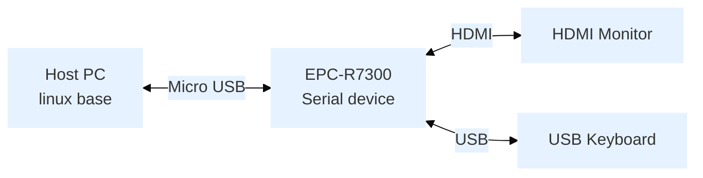

:::tip [Download The BSP Image Here](https://www.dropbox.com/sh/3z9hh9zht98mzil/AABYTUOGQQB0D3MhUqSb7M4ra/officialbuild/risc_nvidia_jetson_35.3.1/2023-07-03?dl=0&subfolder_nav_tracking=1)
MD5： `ba1c04b611fd48de3ce5b91d6320c349`
<br/>Version： RTM
:::

## Overview
- Release Date: 2023/07/03
- Support Product: EPC-R7300


## Comment
### Update
| No. | Description                                                                                         |
|-----|-----------------------------------------------------------------------------------------------------|
| 1   | Add the nvepcr7300a1 hostname                                                                       |
| 2   | Add the method of expanding rootfs automatically after first boot                                   |
| 3   | Fix the apt-get update fail                                                                         |
| 4   | Support Sierra EM7565 module                                                                        |
| 5   | Add tpm2-tools, glmark2, stress, python3-pip, memtester, fim, udhcpc, and jetson-stats packages     |
| 6   | Fix system hang while adjusted date time widget                                                     |
| 7   | Set default audio path to I2S4                                                                      |
| 8   | Add the cp210x udev rules to set the /dev/ttyCP210X0, /dev/ttyCP210X1, /dev/ttyCP210X2 device node of cp210x |
| 9   | Support wdt stop function                                                                           |
| 10  | Remove the UIO EEPROM i2c device and modify the EEPROM of 40 pins to 24c64                          |
| 11  | Add the proc board type                                                                             |

## Features

| Component       | Version                |
|-----------------|------------------------|
| SOM             | ORIN NX 8G/16G and ORIN Nano 4G/8G |
| Jetpack version | 5.1.1                  |
| L4T version     | 35.3.1                 |
| Kernel version  | 5.10.104               |
| TensorRT        | 8.5.2                  |
| cuDNN           | 8.6.0                  |
| CUDA            | 11.4.19                |
| VPI             | 2.2                    |
| OpenCV          | 4.5.4                  |


## Flash Step
### Device Connection



### Entering Recovery Mode

The device supports two methods to enter recovery mode:

#### Command Trigger Mode
1. Connect the Micro USB cable to the Host PC
2. Run command on Host PC:
   ```bash
   sudo reboot --force forced-recovery
   ```
3. Verify recovery mode by checking if **NVIDIA Corp** is detected:
   ```bash
   lsusb | grep "NVIDIA Corp"
   ```
   Expected output: `XXXX:XXXX NVIDIA Corp`

#### Device Trigger Mode
1. Open the back cover
2. Connect the Micro USB cable to the Host PC
3. Press the SW1 button and power on
4. Verify recovery mode by checking if **NVIDIA Corp** is detected:
   ```bash
   lsusb | grep "NVIDIA Corp"
   ```
   Expected output: `XXXX:XXXX NVIDIA Corp`

### Start flash BSP
#### Run Command on Host PC
- Extracted BSP image file
``` bash
$  sudo tar -zxvf 7300A1AIM35UIV20026_2023-07-03.tgz
```
- Switch Directory
``` bash
$  cd Linux_for_Tegra
```
- To flash QSPI + NVME SSD:
``` bash
$ sudo ./tools/kernel_flash/l4t_initrd_flash.sh --external-device nvme0n1p1 -c tools/kernel_flash/flash_l4t_external.xml -p "-c bootloader/t186ref/cfg/flash_t234_qspi.xml" --showlogs --network usb0 jetson-orin-epcr7300-a1 internal
```

## Test Report