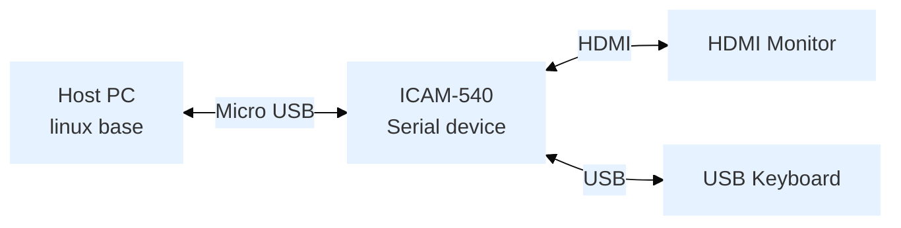

:::tip [Download The BSP Image Here](https://www.dropbox.com/scl/fo/dr6zcn9vfq8eokdh9uug0/AOSd2sKPRTvvxy9S7-zBN1c/AI%20Camera/ICAM-540/ICAM-540-30W?dl=0&rlkey=css95k1m3b0698nn4wrvwisva&subfolder_nav_tracking=1)
MD5： `XXXXXXXXXXXXXXXXXXXXXXXX`
<br/>Version： GA
:::

## Overview
- Release Date: 2025/01/03
- Support Product: 
   - ICAM-540-Cmount
   - ICAM-540-Smount


## Comment
Function are testing

## Features

| SOM              | ORIN NX |
|------------------|------------------------------------|
| Jetpack version  | 5.1.2                             |

## Flash Step
### Device Connection



## Start flash BSP
### Entering Recovery Mode
1. Connect the Micro USB cable to the Host PC.
2. Perform the button sequence:
   - Press and hold Recovery buttons during micro USB connection. Then turn on the power
   - Release the Recovery button after waiting for 3 seconds
3. Verify recovery mode:
   ```bash
   lsusb | grep "NVidia Corp"
   ```
   Expected output: `0955:7423 NVidia Corp`

### Run Command on Host PC
Navigate to your Desktop, If you downloaded the BSP file to a different location, first navigate to your download directory:
```bash
cd ~/Desktop # Or your custom download location
``` 
Extract the SDK archive: 
```bash
sudo tar xvpf "ICAM-540_ORIN-NX_5.1.2_GA_3.1.7.2 advantech.tbz2"
```  

Change into the extracted SDK directory:  
```bash
cd "ICAM-540_ORIN-NX_5.1.2_GA_3.1.7.2 advantech"
``` 

Flash the BSP: 
```bash
sudo ./tools/kernel_flash/l4t_initrd_flash.sh --external-device
nvme0n1p1 -c tools/kernel_flash/flash_l4t_external.xml -p "-c bootloader/
t186ref/cfg/flash_t234_qspi.xml" --showlogs --network usb0 p3509-a02+p3767-
0000 internal
```

After 20 to 30 minutes, you should see a success message as shown below on the Host PC and ICAM-540 will automatically restart. 

You can find the BSP version on the ICAM-540, type
```bash
cat /opt/version
```
Expected output: `ICAM-540_ORIN-NX_5.1.2_GA_3.1.7.2, Build Date:....`

## TestReport