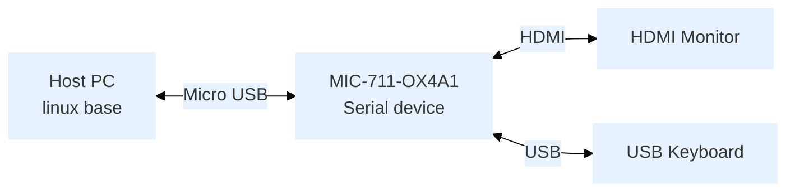
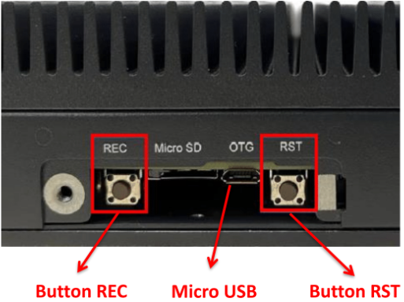

:::tip [Download The BSP Image Here](https://www.dropbox.com/scl/fo/dr6zcn9vfq8eokdh9uug0/AKVqil8vDSDwKZO_xXC5PFw/MIC-711(D)-OX/MIC-711(D)-OX4A1/MIC-711_OrinNX_6.1.0_V1.0.0_SDK?dl=0&rlkey=css95k1m3b0698nn4wrvwisva&subfolder_nav_tracking=1)
MD5： `ccb8d30afd192ad3629133452f66d683`
:::

## Overview
- Release Date: 2025/04
- Support Product: MIC-711-OX4A1

## Flash Step
### Device Connection



### Entering Recovery Mode
1. Power Off
   - Make sure the MIC-711 is completely shut down.
2. Connect USB Cable
   - Use a USB Type-A to Micro USB cable to connect the MIC-711 (Micro USB port) to your host PC.
3. Prepare to Enter Flash Mode
   - Do not power on the device yet.
   - Press and hold the `REC` button.

      

4. Power On and Reset
   - While still holding the “REC” button, plug in the power cable to turn on the device.
   - Press the “RST” button once.
5. Hold and Release
   - Keep holding the “REC” button for about 5–10 seconds, then release it.
6. On Host PC,verify recovery mode by checking if **NVIDIA Corp** is detected:
   ```bash
   lsusb | grep "NVIDIA Corp"
   ```
   Expected output: `0955:7323 NVIDIA Corp`

### Start flash BSP
#### Run Command on Host PC
- Extracted BSP image file
``` bash
$ cd Desktop/
$ sudo tar -zxvf MIC-711_OrinNX_6.1.0_V1.0.0_SDK.tbz2
```
- Switch Directory
``` bash
$  cd Desktop/MIC-711_OrinNX_6.1.0_V1.0.0_SDK
```
- Make sure host pc connects to net cable, and can access network. Run below command to check
```
$ sudo ./tools/l4t_flash_prerequisites.sh
```

- To flash QSPI + NVME SSD:
``` bash
$ sudo ./tools/kernel_flash/l4t_initrd_flash.sh --external-device nvme0n1p1 -c tools/kernel_flash/flash_l4t_external.xml -p "-c bootloader/t186ref/cfg/flash_t234_qspi.xml" --showlogs --network usb0 p3509-a02+p3767-0000 internal
```

## Note
- Please not use Vitrual Linux as host because there is easily usb problem.
- Please not use USB Hub between host PC and MIC device.
- Please not use account `root` to execute command.
- Please attach HDMI monitor to MIC device, until flash process had done and MIC boot in OS