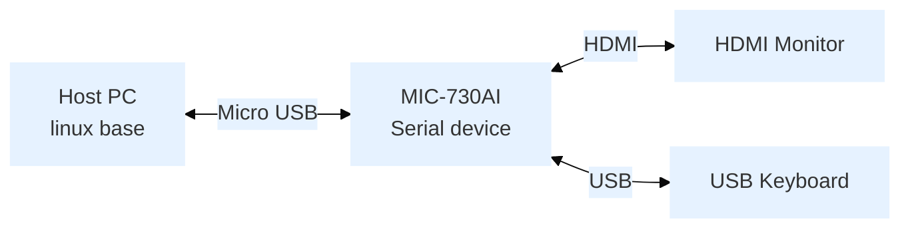

:::tip [Download The BSP Image Here](https://www.dropbox.com/scl/fo/dr6zcn9vfq8eokdh9uug0/AKY1Fnv5HgXxVMm0GUUwJ0Y/MIC-730AI/MIC-730AI_Xavier_5.1.3_V1.0.3_SDK?rlkey=css95k1m3b0698nn4wrvwisva&e=1&subfolder_nav_tracking=1&dl=0)
MD5： `CC7F3F8428F601D40E0B8EC91989C0E1`
<br/>Version： Alpha
:::

## Overview
- Release Date: 2024/09/03
- Support Product: MIC-730AI


## Comment
Function are testing

## Feature

| SOM              | ORIN NX 8G/16G and ORIN Nano 4G/8G |
|------------------|------------------------------------|
| Jetpack version  | 5.1.3                              |

## Flash Step
### Device Connection


### Host PC Dependency Installation

Run the following command to install the necessary dependencies:
```bash
sudo apt-get update && sudo apt-get install -y python sshpass abootimg nfs-kernel-server libxml2-utils binutils qemu-user-static
```
### Start flash BSP
#### Entering Recovery Mode
1. Connect the Micro USB cable to the Host PC.
2. Perform the button sequence:
   - Hold the **REC** button.
   - Click **RST** button.
   - Release the **REC** button after 5 seconds.
3. Verify recovery mode:
   ```bash
   lsusb | grep "NVidia Corp"
   ```
   Expected output: `0955:7019 NVidia Corp`

#### Run Command on Host PC
Navigate to your Desktop, If you downloaded the BSP file to a different location, first navigate to your download directory:
```bash
cd ~/Desktop # Or your custom download location
``` 
Extract the SDK archive: 
```bash
sudo tar xvpf MIC-730AI_Xavier_5.1.3_V1.0.3_SDK.tbz2
```  

Change into the extracted SDK directory:  
```bash
cd MIC-730AI_Xavier_5.1.3_V1.0.3_SDK
``` 

Flash the BSP: 
```bash
sudo ./flash.sh jetson-agx-xavier-devkit mmcblk0p1
```

## TestReport