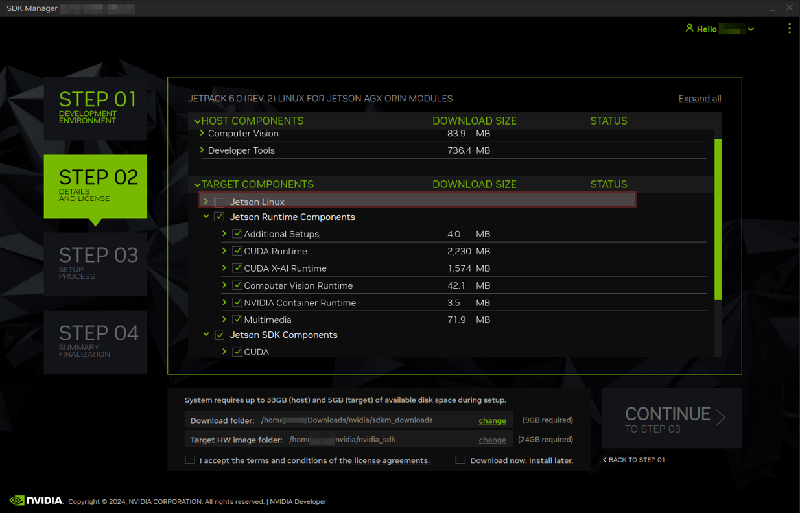

# Introduction

This documentation covers:

- Setting up development environments with JetPack SDK and BSP configurations
- Configuring Docker for GPU acceleration and display access
- Deploying optimized containers for production use cases
- Implementing security best practices and scalable architectures

Whether you're new to NVIDIA ecosystem or an experienced developer, you'll find detailed instructions for maximizing GPU-accelerated computing in industrial deployments.

## Product model and Installation Requirements

Different Advantech product models require specific setup procedures and configurations. Select your hardware model from the following sections to access detailed environment setup instructions:

Choose the appropriate hardware model section in the BSP chapters for specific installation and configuration guidelines.
 

## Software Requirements

> **Note:** NVIDIA software and driver versions are continuously updated. The information below may change at any time. For the latest requirements, please refer to the [NVIDIA official website](https://developer.nvidia.com/).

<br/>

> **Advantech Container Images:** The software versions provided by Advantech for container images may vary due to the diversity of containers. Please refer to the [Advantech Container Catalog](https://catalog.advantech.com/) for detailed descriptions of each image.

--------------------------------------------

The following example uses **[GPU Passthrough](https://catalog.advantech.com/en-us/containers/jetson-gpu-passthrough)** as a reference for software requirements:

| Component         | Details                                 |
|-------------------|-----------------------------------------|
| JetPack           | 5.X                                     |
| CUDA®             | 11.4.315                                |
| cuDNN             | 8.6.0.166                               |
| TensorRT™         | 8.5.2.2                                 |
| VPI               | 2.2.7 or above                          |
| Vulkan            | 1.3.204 or above                        |
| OpenCV Version    | 4.5.4                                   |

### BSP Image
Advantech's products come with a specific version of JetPack pre-installed. If the version does not meet your requirements, you can find the updated BSP (Board Support Package) for the corresponding hardware in the **[BSP Image section](/BSP/Overview)**. Follow the tutorial to complete the BSP version flash process.

### How to check your information
jtop is a system monitoring tool designed specifically for the NVIDIA Jetson™, similar to the top command in Linux systems, but providing more detailed hardware and system information for Jetson™ devices. 

#### Features
This tool displays detailed information about Jetson™ devices, including:

- Platform information: Processor architecture, operating system, release version, etc.
- Hardware information: Model, serial number, module type, etc.
- Library versions: CUDA®, cuDNN, TensorRT™, etc.
- Network interfaces: Network connection information

#### Installation and Usage
To install and use jtop, you can typically install it via pip:

```bash
pip install -U jetson-stats
```

Then simply enter the jtop command in the terminal to launch this monitoring tool:

```bash
jtop
```

## Jetson™ Software Package Installation
NVIDIA SDK Manager provides an end-to-end development environment setup solution for NVIDIA’s Jetson, Holoscan, Rivermax, DeepStream, GXF Runtime, Aerial Research Cloud (ARC-OTA), Ethernet Switch, RAPIDS, DRIVE and DOCA SDKs for both host and target devices.

Advantech will only build in Jetpack components on the device. If you need to install other components, please follow the document: **[Download and Run SDK Manager](https://docs.nvidia.com/sdk-manager/download-run-sdkm/index.html)**

:::caution Notice on OS Installation
Please note that installing the OS directly on the device may cause driver abnormalities. If you encounter any OS-related issues, please refer to the BSP (Board Support Package) section for adjustments and proper configuration.


:::

:::note
NVIDIA is a registered trademark of NVIDIA Corporation. This article is for educational purposes only and is not affiliated with or endorsed by NVIDIA Corporation.
:::