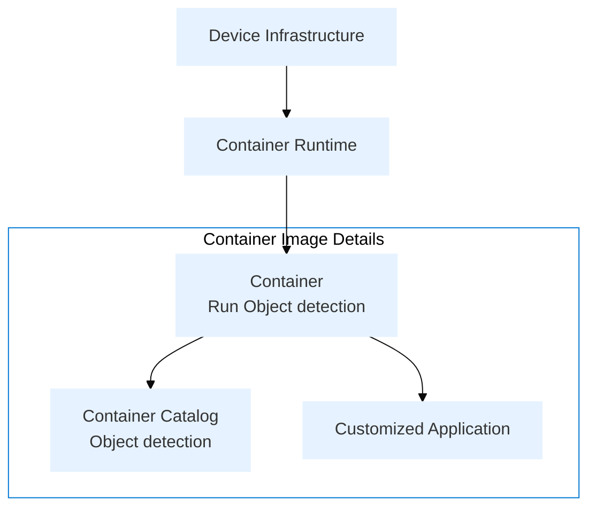

## The Challenge: Hardware Diversity

Developing for multiple hardware platforms introduces critical challenges:

- **Driver Complexity**: Each hardware platform requires unique drivers and dependencies
- **Environment Inconsistency**: Maintaining identical development setups across platforms is difficult
- **Extended Development Time**: Hardware-specific configurations significantly delay product launches
- **Testing Overhead**: Validating across hardware variants consumes excessive resources

## Container Technology as the Solution

Containerization directly addresses these hardware diversity challenges:

- **Isolation**: Containers encapsulate applications and their dependencies, eliminating conflicts with other system components
- **Portability**: Containerized applications run consistently across development, testing, and production environments
- **Resource Efficiency**: Containers share the host OS kernel, consuming fewer resources than virtual machines while maintaining isolation
- **DevOps Enablement**: Containers bridge the gap between development and operations with consistent environments
- **Scalability**: Container orchestration platforms enable easy management across diverse hardware

## Advantech Container Catalog: The Enhanced Solution

While standard containerization offers benefits, Advantech's Container Catalog provides additional value:

- **Hardware-Optimized Base Images**: Pre-configured images specifically tuned for Advantech hardware platforms
- **Integrated Drivers**: Base images include necessary hardware drivers, eliminating complex setup procedures
- **Validated Compatibility**: Thoroughly tested environments ensure reliable operation across the hardware portfolio
- **Development Acceleration**: Ready-to-use images with pre-installed dependencies dramatically reduce time-to-market
- **Simplified Operations**: Standardized deployment approach streamlines management of heterogeneous device fleets


:::info  
**[Advantech Container Catalog Website](https://dev-marketplace.advantech.com/en-us/containers?pageIndex=1)**
provides a variety of application containers. you can visit the website to find the corresponding application for your requirements
:::

## Architecture


## Container Development Comparison

### Traditional Development
Using traditional Docker development requires extensive setup:

```dockerfile
FROM nvcr.io/nvidia/l4t-jetpack:r35.4.1

# Highlights of required setup:
# 1. Environment Variables
ENV DEBIAN_FRONTEND=noninteractive \
    NVIDIA_VISIBLE_DEVICES=all \
    CUDA_HOME="/usr/local/cuda"

# 2. System Dependencies
RUN apt-get update && apt-get install -y --no-install-recommends \
    git wget ffmpeg libsm6 libxext6 \
    # ... more dependencies

# 3. Python Packages
RUN pip3 install --no-cache-dir \
    ultralytics torch torchvision opencv-python \
    # ... more packages

# 4. Workspace Setup
RUN mkdir -p /workspace/{app,data,models,results,logs,configs}

# Application Setup
COPY app/ /workspace/app/
CMD ["python3", "app/main.py"]
```

### EdgeSync Development
With EdgeSync Container, development is simplified:

```dockerfile
FROM edgesync.io/Vision/VideoDetech:1.0.0

# Only application-specific setup needed
COPY app/ /workspace/app/
CMD ["python3", "app/main.py"]
```

:::tip Best Practice
Always use version tags when specifying base images to ensure reproducible builds.
:::

:::caution
Remember to handle sensitive data and credentials appropriately in your Dockerfile.
:::

## Comparison Table

| Feature | Traditional Development | EdgeSync Development |
|---------|------------------------|---------------------|
| Setup Time | Longer (requires full environment setup) | Quick (pre-configured) |
| Image Size | Larger (full dependencies) | Optimized |
| Customization | Full control | Limited to base image |
| Maintenance | Manual dependency updates | Automated updates |

## Usage

### Building the Container
```bash
docker build -t VisionAppV1 .
```

### Running the Container
```bash
docker run -it --gpus all \
  --env DISPLAY=$DISPLAY \
  --volume /tmp/.X11-unix:/tmp/.X11-unix \
  VisionAppV1
```