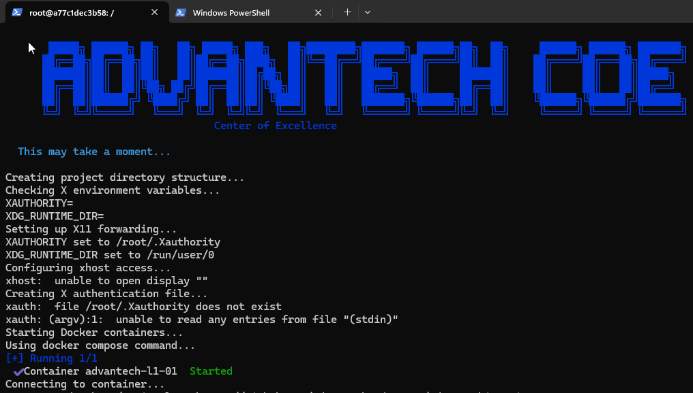
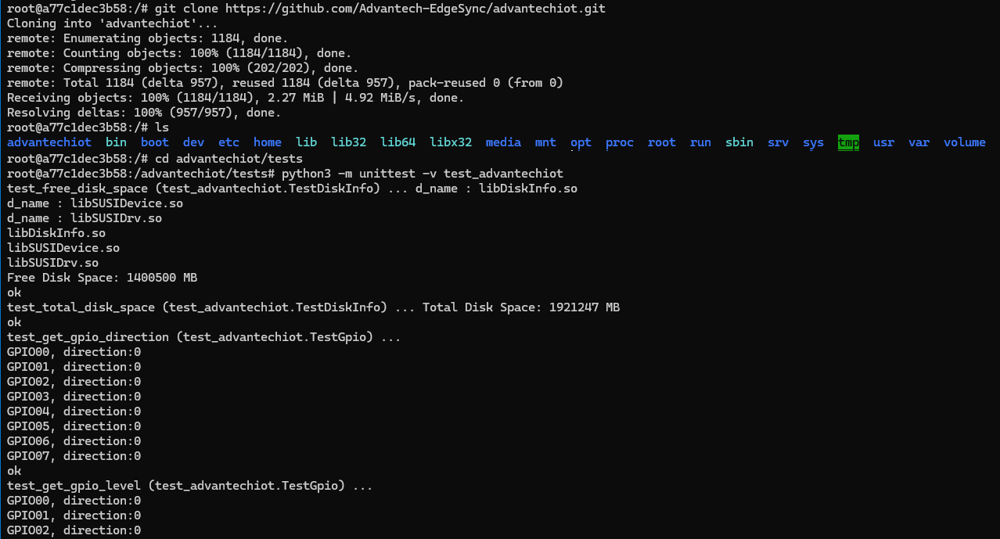
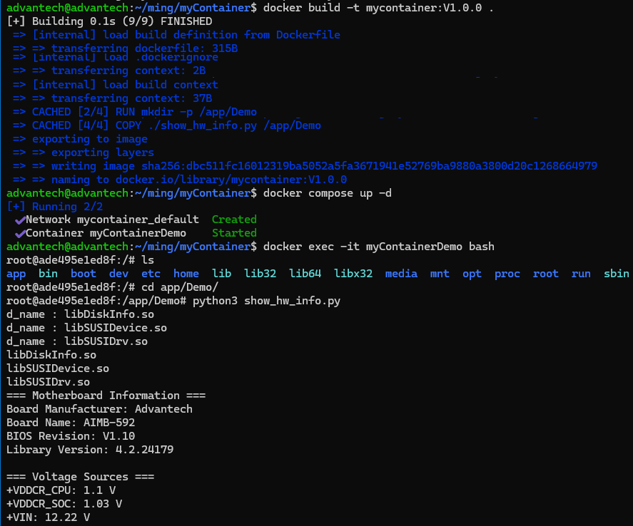

## What is Device Library
The [EdgeSync Device Library](/EdgeSync/library/Architecture) provides a simplified hardware abstraction layer for Python and C# applications to streamline device initialization and data exchange. By unifying different hardware operations under a single interface, developers can focus on application logic and system integration without worrying about low-level details. Whether gathering sensor data or controlling various devices, all interactions are handled consistently to emphasize clear architecture relationships and efficient development. 

## Advantech Container Catalog
Advantech provides an [x86 EdgeSync Base Container](https://catalog.advantech.com/en-us/containers/x-edgesync-base-container) image with a built-in Device Library. This section explains how to work with the Device Library and the container image.

## Demo Scenario
A software developer needs to get the CPU temperature on a device.  Using Advantech's device library container, they can quickly build and deploy a Python application for this purpose. This approach allows the developer to focus on application logic, leveraging the pre-built device access libraries within the container.

### Before you start

To follow this tutorial effectively, familiarity with the following technologies and concepts will be helpful:

- **Basic Docker knowledge**: Understanding of containers, images, and Docker Compose
- **Command-line proficiency**: Ability to navigate Linux terminal and execute bash commands
- **Python fundamentals**: Basic understanding of Python syntax and function definitions

No specialized knowledge of hardware interfaces is required, as the Device Library abstracts these details for you.

If you need to strengthen your knowledge in these areas, [here](#resources) are some helpful resources.

### Run the container

1. Visit the [x86 EdgeSync Base Container](https://catalog.advantech.com/en-us/containers/x-edgesync-base-container) website to review container details, and system requirements.

2. Download the required Docker Compose file and build script from [GitHub](https://github.com/Advantech-EdgeSync-Containers/X86-GPU_Passthrough-EdgeSync-SDK/tree/main/l1-01)

3. Place both files (`build.sh` and `docker-compose.yml`) in the same directory on your device.

4. Run the build script with the following commands:
   ```bash
   chmod +x build.sh
   sudo ./build.sh
   ```
5. After running build.sh, you will enter the container with a bash UI
   

6. (Option) You can download the test sample code and run the test code in the container
   ```bash
   git clone https://github.com/Advantech-EdgeSync/advantechiot.git
   cd advantechiot/tests
   python3 -m unittest -v test_advantech_edge
   ```
   

### Build and run your own application
Back to our demo scenario

1. On your device, create a new folder
   ```bash
   mkdir myContainer
   cd myContainer
   ```

2. Create a file `show_hw_info.py` under myContainer folder
   ```python
   import advantech     #import the library

   def print_board_info(device):
      print("=== Motherboard Information ===")
      print(f"Board Manufacturer: {device.platform_information.manufacturer}")
      print(f"Board Name: {device.platform_information.motherboard_name}")
      print(f"BIOS Revision: {device.platform_information.bios_revision}")
      print(f"Library Version: {device.platform_information.library_version}")
      print()

   def print_voltages(device):
      print("=== Voltage Sources ===")
      for src in device.onboard_sensors.voltage_sources:
         voltage = device.onboard_sensors.get_voltage(src)
         print(f"{src}: {voltage} V")
      print()

   def print_temperatures(device):
      print("=== Temperature Sources ===")
      for src in device.onboard_sensors.temperature_sources:
         temp = device.onboard_sensors.get_temperature(src)
         print(f"{src}: {temp} °C")
      print()

   def main():
      device = advantech.edge.Device()
      print_board_info(device)
      print_voltages(device)
      print_temperatures(device)

   if __name__ == "__main__":
      main()
   ```

2. Create your docker file under myContainer folder
   ```Dockerfile
   #Replace the tag, visit the https://catalog.advantech.com/en-us/containers/x-edgesync-base-container/tags
   FROM edgesync.azurecr.io/advantech/x-edgesync-base-container:1.0.0-Ubuntu22.04-x86

   RUN mkdir -p /app/Demo

   RUN pip install advantech-edge

   COPY ./show_hw_info.py /app/Demo
   ```

3. Build your own container
   ```bash
   docker build -t mycontainer:V1.0.0 .
   ```

4. Create your own `docker-compose.yml` under myContainer folder   
   ```yml
   # Copy the base file from here: https://github.com/Advantech-EdgeSync-Containers/X86-GPU_Passthrough-EdgeSync-SDK/blob/main/l1-01/docker-compose.yml
   # Change the image to your previous step image name
   # All the bind volumes can't be modified or removed.
   services:
   advantech:
      image: mycontainer:V1.0.0
      container_name: myContainerDemo
      privileged: true
      volumes:
         - type: bind
         source: /opt/Advantech/susi/service/
         target: /opt/Advantech/susi/service/
         read_only: true
         - type: bind
         source: /etc/Advantech/susi/service/
         target: /etc/Advantech/susi/service/
         read_only: true
         - type: bind
         source: /usr/lib/x86_64-linux-gnu/libjansson.so.4
         target: /usr/lib/x86_64-linux-gnu/libjansson.so.4
         read_only: true
         - type: bind
         source: /usr/lib/libjansson.so.4
         target: /usr/lib/libjansson.so.4
         read_only: true
         - type: bind
         source: /usr/lib/libjansson.so
         target: /usr/lib/libjansson.so
         read_only: true
         - type: bind
         source: /usr/lib/libSusiIoT.so
         target: /usr/lib/libSusiIoT.so
         read_only: true
         - type: bind
         source: /usr/lib/libSUSIDevice.so.1
         target: /usr/lib/libSUSIDevice.so.1
         read_only: true
         - type: bind
         source: /usr/lib/libSUSIDevice.so
         target: /usr/lib/libSUSIDevice.so
         read_only: true
         - type: bind
         source: /usr/lib/libSUSIAI.so.1
         target: /usr/lib/libSUSIAI.so.1
         read_only: true
         - type: bind
         source: /usr/lib/libSUSIAI.so
         target: /usr/lib/libSUSIAI.so
         read_only: true
         - type: bind
         source: /usr/lib/libSUSI-4.00.so.1adv
         target: /usr/lib/libSUSI-4.00.so.1
         read_only: true
         - type: bind
         source: /usr/lib/libSUSI-4.00.so
         target: /usr/lib/libSUSI-4.00.so
         read_only: true
         - type: bind
         source: /usr/lib/libSUSI-3.02.so.1
         target: /usr/lib/libSUSI-3.02.so.1
         read_only: true
         - type: bind
         source: /usr/lib/libSUSI-3.02.so
         target: /usr/lib/libSUSI-3.02.so
         read_only: true
         - type: bind
         source: /usr/lib/libEApi.so.1
         target: /usr/lib/libEApi.so.1
         read_only: true
         - type: bind
         source: /usr/lib/libEApi.so
         target: /usr/lib/libEApi.so
         read_only: true
         - type: bind
         source: /usr/lib/Advantech
         target: /usr/lib/Advantech
         read_only: true
      tty: true
      stdin_open: true
      command: bash
   ```

5. The final folder should be like this.
   ```bash
   advantech@advantech:~/myContainer$ ls
   docker-compose.yml  Dockerfile  show_hw_info.py
   ```
   
6. Testing the application, make sure you are in the myContainer directory
   ```bash
   docker compose up -d
   docker exec -it myContainerDemo bash 
   ```

7. In the container, execute the application
   ```bash
   cd app/Demo/
   python3 show_hw_info.py
   ```
   Sample result:
   ```bash
   === Motherboard Information ===
   Board Manufacturer: Advantech
   Board Name: AIMB-592
   BIOS Revision: V1.10
   Library Version: 4.2.24179

   === Voltage Sources ===
   +VDDCR_CPU: 1.1 V
   +VDDCR_SOC: 1.03 V
   +VIN: 12.22 V
   +V5SB: 5.04 V
   +VBAT: 3.06 V

   === Temperature Sources ===
   CPU Temperature: 51.9 °C
   System0 Temperature: 46.2 °C
   System1 Temperature: 46.7 °C
   ```


## Resources
- [Docker Documentation](https://docs.docker.com/get-started/docker-overview/)
- [Python.org Official Tutorial](https://docs.python.org/3/tutorial/)
- [Linux Command Library](https://ubuntu.com/tutorials/command-line-for-beginners#1-overview)
- [Advantech EdgeSync Device Library](https://developer.edgesync.cloud/EdgeSync/library/Architecture)
