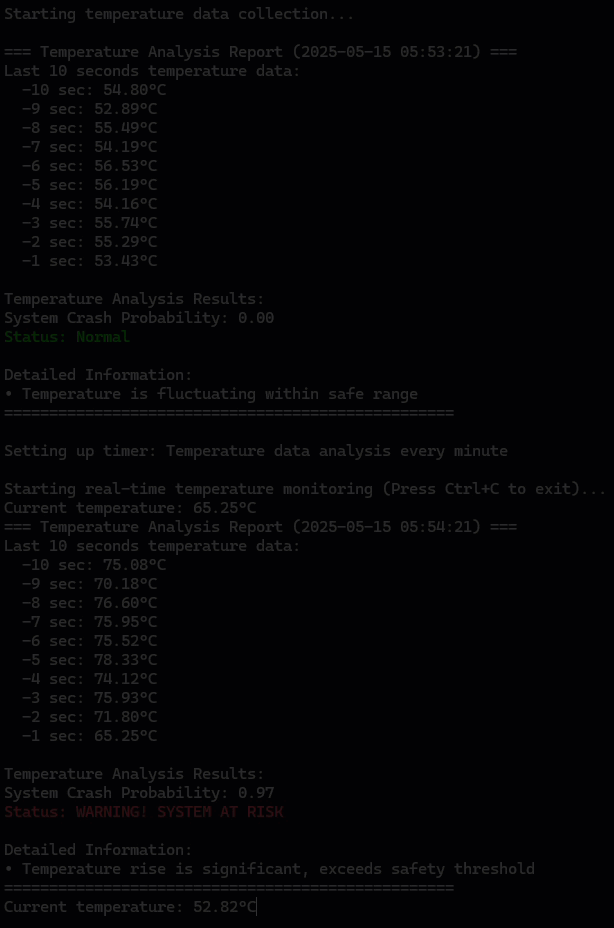

## What is GPU pass-through
GPU pass-through technology allows containerized applications to directly access the GPU hardware resources of the host system. This provides containers with bare-metal performance for GPU-intensive workloads, making it ideal for AI/ML applications that require significant computational power. By enabling direct GPU access, applications can utilize GPU cores for parallel processing, significantly accelerating training and inference tasks compared to CPU-only environments.

## Advantech Container Catalog
Advantech provides an [GPU Passthrough](https://catalog.advantech.com/en-us/containers/jetson-gpu-passthrough) with built-in support for GPUs and frameworks like PyTorch, TensorFlow, and CUDA®. This section explains how to leverage GPU pass-through capabilities for AI applications using this container image.

## Demo Scenario
A data center administrator needs to proactively monitor server temperatures to prevent system crashes and hardware failures. Using Advantech's GPU-accelerated container, they can deploy a real-time temperature monitoring system that uses deep learning to predict potential system failures before they occur. This approach leverages historical temperature data and LSTM (Long Short-Term Memory) neural networks to detect anomalous temperature patterns that precede system crashes.

### Before you start

To follow this tutorial effectively, familiarity with the following technologies and concepts will be helpful:

- **Docker and container orchestration**: Understanding of containers, images, GPU pass-through, and Docker Compose
- **Python programming**: Knowledge of Python, PyTorch, and deep learning concepts
- **GPU computing**: Basic familiarity with CUDA® and GPU acceleration principles
- **System monitoring**: Understanding of hardware monitoring and temperature thresholds

If you need to strengthen your knowledge in these areas, [here](#resources) are some helpful resources.

### Run the container

1. Visit the [GPU Passthrough](https://catalog.advantech.com/en-us/containers/jetson-gpu-passthrough) website to review container details, GPU compatibility, and system requirements.

2. Ensure your system has compatible GPUs with appropriate drivers installed, as the container requires GPU pass-through capabilities.

3. Download the required Docker Compose file and build script from [GitHub](https://github.com/Advantech-EdgeSync-Containers/ACC-L2-02-Edge-AI-enabled-Container)

4. Place both files (`build.sh` and `docker-compose.yml`) in the same directory on your device.

5. Run the build script with the following commands:
   ```bash
   chmod +x build.sh
   sudo ./build.sh
   ```

6. After running build.sh, you will enter the container with a bash UI

### Build and run your own application

#### Understanding the demo components

This demo consists of several key components:

1. **Training Dataset**: The [`fake_temp.csv`](#fake_tempcsv) file contains historical temperature data paired with binary labels indicating whether a system crash occurred. This dataset is used to train our predictive model.

2. **LSTM Neural Network Model**: The [`train.py`](#trainpy) script defines and trains a deep learning model using PyTorch's LSTM cells, which are particularly suited for sequence data like temperature patterns over time.

3. **Real-time Monitoring System**: The [`ai.py`](#aipy) script implements a monitoring system that continuously collects temperature data and uses the trained model to predict potential system failures.

### Start Coding and build image 
1. On your device, create a new folder
   ```bash
   mkdir myContainer
   cd myContainer
   ```

2. Create/Copy below files uder myContainer
   - [`fake_temp.csv`](#fake_tempcsv)
   - [`train.py`](#trainpy)
   - [`ai.py`](#aipy)
   - [`runfake.py`](#runfakepy) to make the mock data to training.

3. Create/Copy your [docker file](#dockerfile) under myContainer folder

4. Build your own container
   ```bash
   docker build -t myapp:V1.0.0 .
   ```

5. Create/Copy your [docker Compose](#docker-composeyml) under myContainer folder

6. Testing the application, make sure you are in the myContainer directory

   ```bash
   docker compose up -d
   docker exec -it myapp bash 
   ```

7. In the container training the model.

   ```bash
   cd /app/Demo
   python3 train.py

   ## Expect Result:
   ## Run on: GPU mode
   ## Epoch 1, Loss: 0.0206
   ## Epoch 2, Loss: 0.0089
   ## Model training completed and saved.
   ```

8. Run the monitoring system.
   ```bash
   python3 ai.py
   ```

   

### Summary of the Demo

This demo serves as a simple proof-of-concept to demonstrate how you can:

1. **Utilize GPU Resources**: Verify that our container effectively accesses and utilizes GPU hardware resources
2. **Train Models on GPU**: Show that AI models can be trained using GPU acceleration within the container
3. **Perform Inference**: Confirm that predictive functionality can run efficiently with GPU support

The temperature monitoring scenario is a straightforward example chosen to illustrate these capabilities, not to represent a production-ready monitoring system.

## Source Code

### fake_temp.csv
```csv
timestamp,temperature,crash
0,56.80147341051153,0
1,55.412888672380454,0
2,56.66728750403718,0
3,57.69486812141695,0
4,54.240586445734856,0
5,54.1672623382035,0
6,54.42810667906887,0
7,54.24414035461038,0
8,52.38623279590845,0
...more
```

### train.py
```python
import torch
import torch.nn as nn
import pandas as pd
import numpy as np
from torch.utils.data import Dataset, DataLoader

class TemperatureDataset(Dataset):
    def __init__(self, csv_path, window_size=60):
        df = pd.read_csv(csv_path)
        temps = df['temperature'].values
        labels = df['crash'].values
        self.samples = []
        self.targets = []
        for i in range(len(temps) - window_size):
            self.samples.append(temps[i:i+window_size])
            self.targets.append(labels[i+window_size-1])
        self.samples = np.array(self.samples, dtype=np.float32)
        self.targets = np.array(self.targets, dtype=np.float32)

    def __len__(self):
        return len(self.samples)

    def __getitem__(self, idx):
        return self.samples[idx], self.targets[idx]

class LSTMClassifier(nn.Module):
    def __init__(self, input_size=1, hidden_size=32, num_layers=1):
        super().__init__()
        self.lstm = nn.LSTM(input_size, hidden_size, num_layers, batch_first=True)
        self.fc = nn.Linear(hidden_size, 1)
        self.sigmoid = nn.Sigmoid()

    def forward(self, x):
        x = x.unsqueeze(-1)  # (batch, seq_len, 1)
        out, _ = self.lstm(x)
        out = out[:, -1, :]
        out = self.fc(out)
        out = self.sigmoid(out)
        return out.squeeze()

# Dataset and Model
dataset = TemperatureDataset('fake_temp.csv', window_size=60)
dataloader = DataLoader(dataset, batch_size=128, shuffle=True)
device = torch.device("cuda" if torch.cuda.is_available() else "cpu")
print(f"Run on: {'GPU' if device.type == 'cuda' else 'CPU'} mode")
model = LSTMClassifier().to(device)
criterion = nn.BCELoss()
optimizer = torch.optim.Adam(model.parameters(), lr=1e-3)

# Training
for epoch in range(2):
    model.train()
    total_loss = 0
    for batch_x, batch_y in dataloader:
        batch_x = batch_x.to(device)
        batch_y = batch_y.to(device)
        optimizer.zero_grad()
        outputs = model(batch_x)
        loss = criterion(outputs, batch_y)
        loss.backward()
        optimizer.step()
        total_loss += loss.item()
    print(f"Epoch {epoch+1}, Loss: {total_loss/len(dataloader):.4f}")

torch.save(model.state_dict(), "lstm_temp_model.pth")
print("Model training completed and saved.")

```

### ai.py
```python
import collections
import time
import torch
import numpy as np
import datetime
import threading
from train import LSTMClassifier

device = torch.device("cuda" if torch.cuda.is_available() else "cpu")

# Print whether using GPU or CPU
print(f"Using device: {device} ({'GPU' if device.type == 'cuda' else 'CPU'})")

# Reload model
model = LSTMClassifier().to(device)
model.load_state_dict(torch.load("lstm_temp_model.pth"))
model.eval()

def predict_crash(model, temp_history):
    with torch.no_grad():
        x = torch.tensor(np.array(temp_history, dtype=np.float32)).unsqueeze(0).to(device)
        prob = model(x).item()
        return prob, prob > 0.5

def generate_past_minute_temp_data():
    """Generate temperature data for the past minute with second-level precision"""
    temp_history = collections.deque(maxlen=60)
    for i in range(40):
        temp = 55 + np.random.randn() * 1.5
        temp_history.append(temp)
    for i in range(10):
        temp = 57 + np.random.randn() * 1.5
        temp_history.append(temp)
    for i in range(10):
        temp = 65 + np.random.randn() * 2.0
        temp_history.append(temp)
        
    return temp_history

temp_collector = collections.deque(maxlen=60)

def simulate_temp_reading():
    """Function to simulate temperature readings based on a 5-minute cycle pattern
    Minutes 1 and 4 will show normal temperatures, while minutes 2, 3, and 5 will
    show abnormal temperatures.
    """
    current_minute = datetime.datetime.now().minute % 5
    
    if current_minute == 0 or current_minute == 3:
        return 55 + np.random.randn() * 1.5
    else:
        return 75 + np.random.randn() * 5.0

def analyze_temperature_data():
    """Analyze temperature data from the past minute"""
    global temp_collector
    
    if len(temp_collector) < 60:
        print(f"Collecting data... Currently collected {len(temp_collector)} data points, need 60")
        return
    
    now = datetime.datetime.now()
    print(f"\n=== Temperature Analysis Report ({now.strftime('%Y-%m-%d %H:%M:%S')}) ===")
    temp_list = list(temp_collector)
    print(f"Last 10 seconds temperature data:")
    for i in range(-10, 0):
        print(f"  -{abs(i)} sec: {temp_list[i]:.2f}°C")
   
    prob, is_crash = predict_crash(model, temp_collector)
    print("\nTemperature Analysis Results:")
    print(f"System Crash Probability: {prob:.2f}")
    
    if is_crash:
        print(f"\033[91mStatus: WARNING! SYSTEM AT RISK\033[0m")
    else:
        print(f"\033[92mStatus: Normal\033[0m")
    
    if is_crash:
        print("\nDetailed Information:")
        print("• Temperature rise is significant, exceeds safety threshold")
    else:
        print("\nDetailed Information:")
        print("• Temperature is fluctuating within safe range")
    print("="*50)

def scheduler():
    """Timer function, performs temperature analysis once per minute"""
    analyze_temperature_data()
    timer = threading.Timer(60.0, scheduler)
    timer.daemon = True
    timer.start()

def main():
    """Main function, starts the temperature monitoring system"""
    print("Temperature Monitoring System Starting...")
    print(f"Run on {'GPU' if device.type == 'cuda' else 'CPU'} mode")
    print("Starting temperature data collection...")
    for i in range(60):
        temp = simulate_temp_reading()
        temp_collector.append(temp)
    
    analyze_temperature_data()
    
    print("\nSetting up timer: Temperature data analysis every minute")
    timer = threading.Timer(60.0, scheduler)
    timer.daemon = True
    timer.start()
    
    # Main loop: continuously collect temperature data
    try:
        print("\nStarting real-time temperature monitoring (Press Ctrl+C to exit)...")
        while True:
            # Simulate temperature reading
            temp = simulate_temp_reading()
            temp_collector.append(temp)
            print(f"\rCurrent temperature: {temp:.2f}°C", end='', flush=True)
            time.sleep(1) 
    
    except KeyboardInterrupt:
        print("\n\nMonitoring system stopped")

if __name__ == "__main__":
    main()

```

### runfake.py
```python
import numpy as np
import pandas as pd

np.random.seed(42)

total_seconds = 24 * 60 * 60 * 7
temps = []
crash = np.zeros(total_seconds, dtype=np.int32)


crash_points = np.random.choice(range(60, total_seconds-1), size=total_seconds//20000, replace=False)
for pt in crash_points:
    crash[pt-60:pt] = 1 

for i in range(total_seconds):
    base_temp = 55 + np.random.randn() * 2 
    if crash[i] == 1:
        temp = base_temp + np.random.rand() * 10 
    else:
        temp = base_temp
    temps.append(temp)

df = pd.DataFrame({
    'timestamp': np.arange(total_seconds),
    'temperature': temps,
    'crash': crash
})
df.to_csv('fake_temp.csv', index=False)
print('finish the mock data:', df.shape)
```
###

### Dockerfile
```dockerfile
FROM edgesync.azurecr.io/advantech/jetson-gpu-passthrough:1.0.0-Ubuntu20.04-ARM

RUN apt-get update && apt-get install -y python3-pip

RUN pip3 install torch torchvision torchaudio --index-url https://download.pytorch.org/whl/cu113

RUN mkdir -p /app/Demo

RUN pip install torch numpy pandas

COPY ./fake_temp.csv /app/Demo
COPY ./train.py /app/Demo
COPY ./ai.py /app/Demo
```

### docker-compose.yml
```yaml
version: '2.4'
# Copy the base file from here: https://github.com/Advantech-EdgeSync-Containers/ACC-L2-02-Edge-AI-enabled-Container/blob/main/docker-compose.yml
# Change the image to your previous step image name
# All the bind volumes can't be modified or removed.
services:
  advantech-l2-02:
    image: myapp:V1.0.0
    container_name: myapp
    privileged: true
    network_mode: host
    runtime: nvidia
    tty: true
    stdin_open: true
    entrypoint: ["/bin/bash"]
    environment:
      - DISPLAY=${DISPLAY}
      - GPU_VISIBLE_DEVICES=all
      - GPU_DRIVER_CAPABILITIES=all,compute,video,utility,graphics
      - QT_X11_NO_MITSHM=1
      - XAUTHORITY=/tmp/.docker.xauth
    volumes:
      - /tmp/.X11-unix:/tmp/.X11-unix
      - /tmp/.docker.xauth:/tmp/.docker.xauth
      - /etc/gpu_release:/etc/gpu_release
      - /usr/lib/aarch64-linux-gnu/gpu-libs:/usr/lib/aarch64-linux-gnu/gpu-libs
      - /usr/src/multimedia_api:/usr/src/multimedia_api
      - /usr/lib/aarch64-linux-gnu/gstreamer-1.0:/usr/lib/aarch64-linux-gnu/gstreamer-1.0
      - /usr/local/CUDA®:/usr/local/CUDA®
    devices:
      - /dev/gpu-ctrl
      - /dev/gpu-ctrl-gpu
      - /dev/gpu-prof-gpu
      - /dev/gpumap
      - /dev/gpu-gpu
      - /dev/gpu-as-gpu
      - /dev/gpu-vic
      - /dev/gpu-msenc
      - /dev/gpu-dec
      - /dev/gpu-jpg
      - /dev/gpu/igpu0
```

## Resources
- [PyTorch Deep Learning Framework](https://pytorch.org/tutorials/)
- [Docker GPU Guide](https://docs.docker.com/config/containers/resource_constraints/#gpu)
- [Advantech Container Catalog](https://catalog.advantech.com/en-us/containers)
