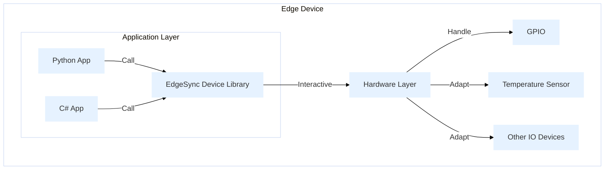
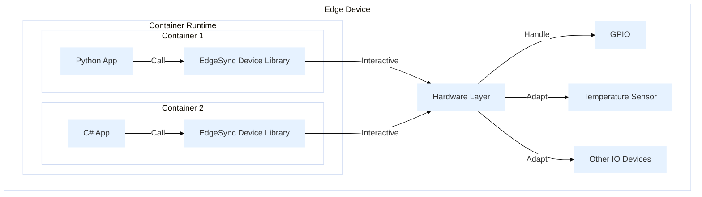

## Overview
The EdgeSync Device Library provides a simplified hardware abstraction layer for Python and C# applications to streamline device initialization and data exchange. By unifying different hardware operations under a single interface, developers can focus on application logic and system integration without worrying about low-level details. Whether gathering sensor data or controlling various devices, all interactions are handled consistently to emphasize clear architecture relationships and efficient development.

## Key Capabilities
The library offers the following features:

### Platform Information
  - Access motherboard manufacturer, board name, BIOS revision, and SDK library version
### Onboard Sensor Information
  - Enumerate voltage sources and read voltage values
  - Enumerate temperature sensors and read temperature values
  - List fan speed sources
### GPIO Control
  - List GPIO pins
  - Get/set pin direction (input/output)
  - Get/set pin level (high/low)
### Memory Information
  - Retrieve total memory count and list available modules
  - Query type, module type, size (GB), speed (MT/s), rank, voltage (V), bank, manufacturing date code, temperature (°C), write protection status, module/manufacturer details, part numbers, and specific metadata
### Disk Information
  - Get total and free disk space (MB)

## Hardware and Software Layer Relationship
During the development phase, this approach effectively reduces complexity and simplifies debugging, allowing developers to focus on implementing and testing core functionalities.

## Containerized Deployment Architecture
In post-development scenarios, this setup enables consistent containerized environments, simplifying maintenance and updates for each application while ensuring reliable hardware interactions at scale.
[Read a Use Case](../Containers/Sample/device)
