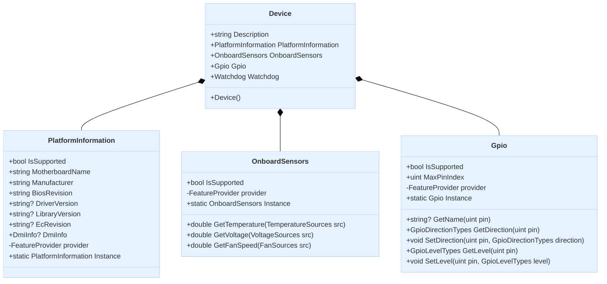

import Tabs from '@theme/Tabs';
import TabItem from '@theme/TabItem';

## Code Architecture

The Device class is the core of the EdgeSync Device library, acting as the main entry point for accessing hardware components. When you create an instance of Device

It initializes and aggregates the following subsystems:

- **PlatformInformation**: Provides platform information such as motherboard name, manufacturer, BIOS revision, driver version, library version, EC revision, and DMI information.
- **OnboardSensors**: Provides access to hardware monitoring sensors, including temperature, voltage, and fan speed readings.
- **Gpio**: Provides GPIO pin query, direction setting, and level read/write functionality.

Each subsystem is exposed as a property on the `Device` instance, and you can use the `IsSupported` property to determine if the device supports the feature. This design centralizes hardware operations within a single object, simplifying resource management and cleanup.

:::note
Device Library is a cross-language component. Therefore, when describing architecture and class dependencies, C# conventions are used. For other languages, please refer to the sample code examples.
:::

## Class Diagram



## Sample Code
<Tabs>
<TabItem value="python" label="Python" default>

```python
import advantech

device = advantech.edge.Device()
```

</TabItem>

<TabItem value="C#" label="C#">

```csharp
using Advantech.Edge;

var device = new Device();
```

</TabItem>
</Tabs>

