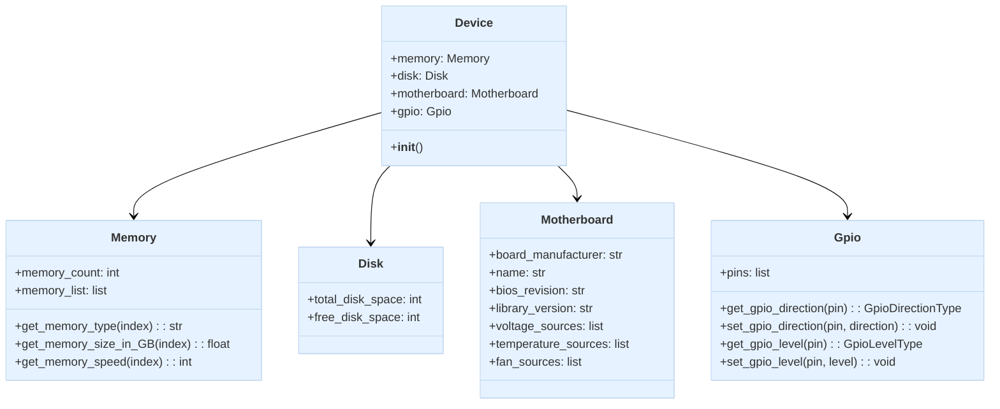

import Tabs from '@theme/Tabs';
import TabItem from '@theme/TabItem';

## Code Architecture

:::tip
Device Library is a cross-language component. Therefore, when describing architecture and class dependencies, Python conventions are used. For other languages, please refer to the sample code examples.
:::

The Device class is the core of the EdgeSync Device library, acting as the main entry point for accessing hardware components. When you create an instance of Device, e.g.:  

```python
from edgesync_sdk import Device

# Initialize device
device = Device()
```

It initializes and aggregates multiple subsystems:

- **memory**: Provides access to system memory information and operations, such as `memory_count`, `get_memory_type()`, and `get_memory_size_in_GB()`.  
- **disk**: Provides disk information, including `total_disk_space` and `free_disk_space`.  
- **motherboard**: Provides platform information, such as `board_manufacturer`, `bios_revision`, and hardware monitor data (voltage, temperature, fan speeds, etc.).  
- **gpio**: Provides General Purpose Input/Output control, allowing you to list pins, set directions, and control levels.  

Each subsystem is exposed as a property on the `Device` instance. This design centralizes hardware interactions within a single object, simplifying resource management and cleanup.

## Class Diagram



## Sample Code
<Tabs>
<TabItem value="python" label="Python" default>

```python
from edgesync_sdk import Device

# Initialize device
device = Device()

```

</TabItem>
<TabItem value="csharp" label="C#">

```csharp
using EdgeSync.SDK;

var device = new Device();
var info = device.PlatformInformation;
Console.WriteLine($"Motherboard: {info.MotherboardName}");
Console.WriteLine($"Manufacturer: {info.Manufacturer}");
Console.WriteLine($"BIOS Revision: {info.BiosRevision}");
if (info.DmiInfo != null)
    Console.WriteLine($"System UUID: {info.DmiInfo.SysUuid}");
```

</TabItem>
</Tabs>

