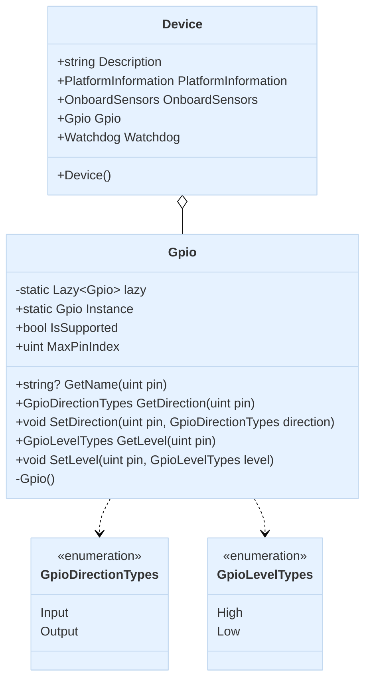

import Tabs from '@theme/Tabs';
import TabItem from '@theme/TabItem';

## Introduction to GPIO

GPIO (General Purpose Input/Output) is a standard interface available on most embedded systems and edge computing devices. The Advantech.Edge library's GPIO component provides a simple and consistent way to interact with these pins, allowing applications to control external hardware or read input signals.

The GPIO class is designed as a singleton pattern and is accessible through its Instance static property, providing a centralized access point for all GPIO operations on the device.

## Features and Capabilities

The GPIO interface offers several key functionalities:

### Pin Management
- **Pin Discovery**: Determine the maximum number of available pins
- **Pin Identification**: Access pin names (when available)

### Direction Control
- **Set Direction**: Configure pins as either input or output
- **Get Direction**: Read the current direction configuration of pins

### Level Control
- **Set Level**: Change the output level of pins (HIGH or LOW)
- **Get Level**: Read the current level state of pins

### Pin States
GPIO pins can have the following properties:

- **Direction**:
  - **Input**: Pin configured to read external signals
  - **Output**: Pin configured to provide signals to external devices

- **Level**:
  - **High**: Logic level high (typically 3.3V or 5V)
  - **Low**: Logic level low (typically 0V/ground)

## Primary Uses

GPIO serves several important purposes in embedded and edge computing applications:

1. **Hardware Control**: Directly control external hardware components like relays, LEDs, or motors

2. **Sensor Integration**: Interface with simple sensors that use digital signals for communication

3. **Device Communication**: Implement custom communication protocols with other devices

4. **System Monitoring**: Monitor status signals from external equipment

5. **User Interaction**: Connect buttons, switches, or simple user interface elements

## Class Diagram



## Usage Examples

<Tabs>
<TabItem value="csharp" label="C#" default>

```csharp
using Advantech.Edge;
using System;

namespace GpioDemo
{
    class Program
    {
        static void Main(string[] args)
        {
            // Access GPIO through Device instance
            var device = new Device();
            var gpio = device.Gpio;

            // Check if the feature is supported
            if (!gpio.IsSupported)
            {
                Console.WriteLine("GPIO feature is not supported on this device.");
                return;
            }

            // Get maximum pin index
            Console.WriteLine($"Maximum GPIO pin index: {gpio.MaxPinIndex}");
            
            // Working with a specific pin (example with pin 0)
            uint pinNumber = 0;
            
            // Get pin name if available
            try
            {
                string? pinName = gpio.GetName(pinNumber);
                Console.WriteLine($"Pin {pinNumber} name: {pinName ?? "Unnamed"}");
            }
            catch (NotSupportedException)
            {
                Console.WriteLine($"Pin names not supported on this device.");
            }

            // Get current pin direction
            try
            {
                var direction = gpio.GetDirection(pinNumber);
                Console.WriteLine($"Pin {pinNumber} direction: {direction}");
            }
            catch (NotSupportedException ex)
            {
                Console.WriteLine($"Error getting pin direction: {ex.Message}");
            }
            
            // Set pin as output
            try
            {
                // Make sure your pinNumber can be set then unmark the code.
                //gpio.SetDirection(pinNumber, GpioDirectionTypes.Output);
                Console.WriteLine($"Set pin {pinNumber} as output");
                
                // Verify the change
                var newDirection = gpio.GetDirection(pinNumber);
                Console.WriteLine($"New pin {pinNumber} direction: {newDirection}");
            }
            catch (NotSupportedException ex)
            {
                Console.WriteLine($"Error setting pin direction: {ex.Message}");
            }
            
            // Set pin level to high
            try
            {
                // Make sure your pinNumber can be set then unmark the code.
                //gpio.SetLevel(pinNumber, GpioLevelTypes.High);
                Console.WriteLine($"Set pin {pinNumber} level to high");
                
                // Verify the change
                var level = gpio.GetLevel(pinNumber);
                Console.WriteLine($"Pin {pinNumber} level: {level}");
            }
            catch (NotSupportedException ex)
            {
                Console.WriteLine($"Error setting/getting pin level: {ex.Message}");
            }
            
            // Set pin as input to read external signals
            try
            {
                // Make sure your pinNumber can be set then unmark the code.
                //gpio.SetDirection(pinNumber, GpioDirectionTypes.Input);
                Console.WriteLine($"Set pin {pinNumber} as input");
                
                // Read input level
                var inputLevel = gpio.GetLevel(pinNumber);
                Console.WriteLine($"Input pin {pinNumber} level: {inputLevel}");
            }
            catch (NotSupportedException ex)
            {
                Console.WriteLine($"Error working with input pins: {ex.Message}");
            }
        }
    }
}
```

</TabItem>
<TabItem value="python" label="Python">

```python
import advantech.edge
from advantech.igpio import GpioDirectionType, GpioLevelType

# Access GPIO through Device instance
device = advantech.edge.Device()
gpio = device.gpio

# Check if GPIO is available by trying to access the pins
try:
    # Get available pins
    available_pins = list(gpio.pins)
    if not available_pins:
        print("No GPIO pins available on this device.")
        exit()
    
    print(f"Available GPIO pins: {available_pins}")
    
    # Working with the first available pin
    pin_name = available_pins[0]
    print(f"Working with pin: {pin_name}")
    
    # Get current pin direction
    current_direction = gpio.get_direction(pin_name)
    print(f"Pin {pin_name} current direction: {current_direction}")
    
    # Set pin as output, Make sure your pinNumber can be set then unmark the code.
    # gpio.set_direction(pin_name, GpioDirectionType.OUTPUT)
    print(f"Set pin {pin_name} as output")
    
    # Verify the change
    new_direction = gpio.get_direction(pin_name)
    print(f"New pin {pin_name} direction: {new_direction}")
    
    # Set pin level to high, Make sure your pinNumber can be set then unmark the code.
    # result = gpio.set_level(pin_name, GpioLevelType.HIGH)
    print(f"Set pin {pin_name} level to high. Result: {result}")
    
    # Verify the level change
    level = gpio.get_level(pin_name)
    print(f"Pin {pin_name} level: {level}")
    
    # Set pin as input to read external signals, Make sure your pinNumber can be set then unmark the code.
    # gpio.set_direction(pin_name, GpioDirectionType.INPUT)
    print(f"Set pin {pin_name} as input")
    
    # Read input level
    input_level = gpio.get_level(pin_name)
    print(f"Input pin {pin_name} level: {input_level}")
    
    # Example of iterating through all available pins
    print("\nAll pin states:")
    for pin in gpio.pins:
        direction = gpio.get_direction(pin)
        level = gpio.get_level(pin)
        print(f"Pin {pin}: direction = {direction}, level = {level}")

except Exception as e:
    print(f"GPIO feature is not supported on this device: {e}")
```

</TabItem>
</Tabs>

## Important Considerations

1. **Hardware Protection**: Always ensure you're aware of the electrical characteristics of your GPIO pins to avoid damaging your hardware:
   - Maximum voltage levels
   - Current limitations
   - Pull-up/pull-down configurations

2. **Pin Configuration**: Some pins may have special functions and might not be available as general-purpose I/O. Consult your device documentation before using specific pins.

3. **Error Handling**: Always implement proper error handling as GPIO operations can fail due to hardware limitations or configuration issues.

4. **Direction Configuration**: Always set the pin direction before attempting to read or write its value.

5. **External Circuitry**: When connecting to external hardware, consider using appropriate circuit protection like level shifters, buffers, or optoisolators.
