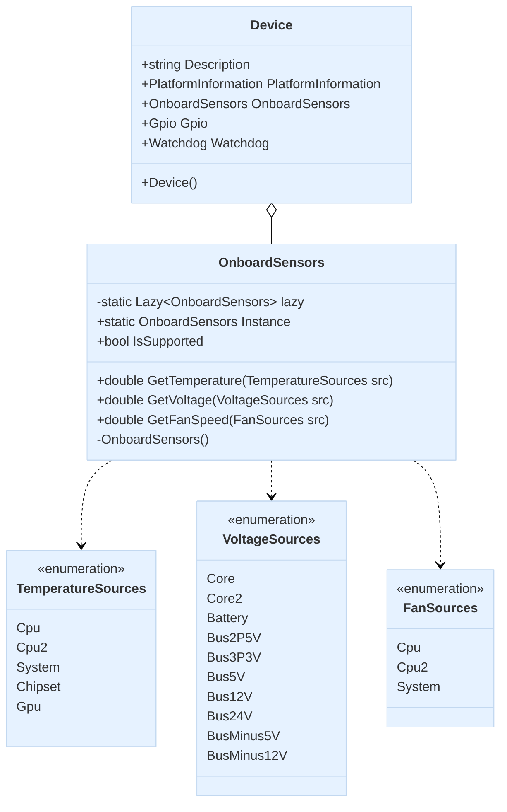

import Tabs from '@theme/Tabs';
import TabItem from '@theme/TabItem';

## Introduction to Onboard Sensors

OnboardSensors is a key component of the Device Library that provides access to hardware monitoring sensors on edge devices. It's designed as a singleton pattern and is accessible through its Instance static property.

This component allows applications to monitor and collect real-time data from various sensors embedded on the device's motherboard, providing critical information about the system's operational health and environmental conditions.

## Available Sensors

The OnboardSensors class provides access to the following types of measurements:

### Temperature Sensors
Monitors temperature data from various components, which typically include:
- **CPU**: Central Processing Unit temperature
- **CPU2**: Secondary CPU temperature (if available)
- **System**: Overall system temperature
- **Chipset**: Motherboard chipset temperature
- **GPU**: Graphics Processing Unit temperature (if available)

### Voltage Sensors
Monitors voltage levels across different power rails, which may include:
- **Core**: CPU core voltage
- **Core2**: Secondary CPU core voltage
- **Battery**: Battery voltage (if applicable)
- **Bus voltages**: Various system voltage rails (2.5V, 3.3V, 5V, 12V, 24V, etc.)

### Fan Speed Sensors
Monitors rotation speed of cooling fans:
- **CPU**: CPU cooling fan
- **CPU2**: Secondary CPU cooling fan
- **System**: System/chassis cooling fan

## Primary Uses

OnboardSensors serves several important purposes:

1. **System Health Monitoring**: Track critical temperature, voltage, and cooling performance in real-time.

2. **Preventive Maintenance**: Detect abnormal sensor readings that might indicate potential hardware failures before they occur.

3. **Performance Optimization**: Monitor temperature trends during different workloads to optimize system performance and cooling strategies.

4. **Environmental Adaptation**: Allow applications to adjust behavior based on system conditions (e.g., throttling intensive operations when temperatures rise).

5. **Power Management**: Monitor voltage levels to ensure stable operation and implement power-saving strategies.

## Class Diagram



## Usage Examples

<Tabs>
<TabItem value="csharp" label="C#" default>

```csharp
using Advantech.Edge;
using System;

namespace OnboardSensorsDemo
{
    class Program
    {
        static void Main(string[] args)
        {
            // Access onboard sensors through Device instance
            var device = new Device();
            var sensors = device.OnboardSensors;

            // Check if the feature is supported
            if (!sensors.IsSupported)
            {
                Console.WriteLine("Onboard sensors feature is not supported on this device.");
                return;
            }

            // Reading temperature sensors
            Console.WriteLine("=== Temperature Sensors ===");
            try
            {
                Console.WriteLine($"CPU Temperature: {sensors.GetTemperature(TemperatureSources.Cpu)} °C");
                Console.WriteLine($"System Temperature: {sensors.GetTemperature(TemperatureSources.System)} °C");
                Console.WriteLine($"Chipset Temperature: {sensors.GetTemperature(TemperatureSources.Chipset)} °C");
            }
            catch (NotSupportedException ex)
            {
                Console.WriteLine($"Some temperature sensors not available: {ex.Message}");
            }

            // Reading voltage sensors
            Console.WriteLine("\n=== Voltage Sensors ===");
            try
            {
                Console.WriteLine($"CPU Core Voltage: {sensors.GetVoltage(VoltageSources.Core)} V");
                Console.WriteLine($"3.3V Bus Voltage: {sensors.GetVoltage(VoltageSources.Bus3P3V)} V");
                Console.WriteLine($"5V Bus Voltage: {sensors.GetVoltage(VoltageSources.Bus5V)} V");
                Console.WriteLine($"12V Bus Voltage: {sensors.GetVoltage(VoltageSources.Bus12V)} V");
            }
            catch (NotSupportedException ex)
            {
                Console.WriteLine($"Some voltage sensors not available: {ex.Message}");
            }

            // Reading fan speeds
            Console.WriteLine("\n=== Fan Speed Sensors ===");
            try
            {
                Console.WriteLine($"CPU Fan Speed: {sensors.GetFanSpeed(FanSources.Cpu)} RPM");
                Console.WriteLine($"System Fan Speed: {sensors.GetFanSpeed(FanSources.System)} RPM");
            }
            catch (NotSupportedException ex)
            {
                Console.WriteLine($"Some fan speed sensors not available: {ex.Message}");
            }
        }
    }
}
```

</TabItem>
<TabItem value="python" label="Python">

```python
import advantech.edge

# Access onboard sensors through Device instance
device = advantech.edge.Device()
sensors = device.onboard_sensors

# Check if sensors are available by trying to access the sources
# (Python implementation might not have a direct IsSupported property)
try:
    temperature_sources = sensors.temperature_sources
    voltage_sources = sensors.voltage_sources
    fan_sources = sensors.fan_sources
    
    # If we get here, at least some sensors are available
    
    # Reading temperature sensors
    print("=== Temperature Sensors ===")
    for source in temperature_sources:
        try:
            temp = sensors.get_temperature(source)
            print(f"{source}: {temp} °C")
        except Exception as e:
            print(f"Could not read {source}: {e}")
    
    # Reading voltage sensors
    print("\n=== Voltage Sensors ===")
    for source in voltage_sources:
        try:
            voltage = sensors.get_voltage(source)
            print(f"{source}: {voltage} V")
        except Exception as e:
            print(f"Could not read {source}: {e}")
    
    # Reading fan speeds
    print("\n=== Fan Speed Sensors ===")
    if hasattr(sensors, 'get_fan_speed'):
        for source in fan_sources:
            try:
                speed = sensors.get_fan_speed(source)
                print(f"{source}: {speed} RPM")
            except Exception as e:
                print(f"Could not read {source}: {e}")
    else:
        print("Fan speed monitoring not implemented in current version")

except Exception as e:
    print(f"Onboard sensors feature is not supported on this device: {e}")
```

</TabItem>
</Tabs>

These code examples demonstrate how to:

1. Obtain an OnboardSensors instance (either through a Device instance or directly using the singleton pattern)
2. Check if this functionality is supported on the current platform
3. Access temperature, voltage, and fan speed sensor readings
4. Handle exceptions for sensors that may not be available on the specific hardware

Note that not all sensor types are available on every device, and the code includes error handling to gracefully manage missing sensors.
