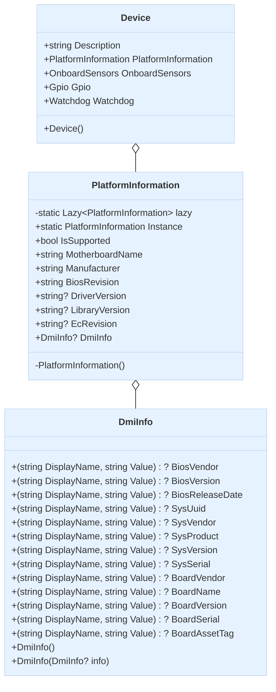

import Tabs from '@theme/Tabs';
import TabItem from '@theme/TabItem';

## Overview

PlatformInformation is a key component of the Device Library that provides access to essential hardware platform information. It's designed as a singleton pattern and is accessible through its Instance static property.

## Available Information

The PlatformInformation class provides access to the following key information:

### Basic Platform Information
- **MotherboardName**: Name of the motherboard
- **Manufacturer**: Name of the manufacturer
- **BiosRevision**: BIOS version
- **EcRevision**: Embedded Controller (EC) version
- **DriverVersion**: Driver version
- **LibraryVersion**: Library version

### DMI (Desktop Management Interface) Information
Through the `DmiInfo` class, more detailed system management information is provided, including:
- BIOS information (vendor, version, release date)
- System information (UUID, vendor, product, version, serial number)
- Motherboard information (vendor, name, version, serial number, asset tag)

## Primary Uses

PlatformInformation serves several important purposes:

1. **Hardware Identification**: Applications can retrieve and display information about motherboards and manufacturers for hardware platform identification and verification.

2. **Version Compatibility Checks**: Software can determine compatibility with the current platform by checking BIOS and driver versions.

3. **System Management**: DMI information is valuable for system management, device inventory, and asset management.

4. **Diagnostics and Troubleshooting**: Provides system-related information that can help diagnose hardware issues.

5. **Device Feature Detection**: Allows applications to dynamically adjust their behavior or functionality based on platform information.

## Class Diagram



## Usage Examples

<Tabs>
<TabItem value="csharp" label="C#" default>

```csharp
using Advantech.Edge;
using System;

namespace PlatformInfoDemo
{
    class Program
    {
        static void Main(string[] args)
        {
            // Access platform information through Device instance
            var device = new Device();
            var platformInfo = device.PlatformInformation;

            // Check if the feature is supported
            if (!platformInfo.IsSupported)
            {
                Console.WriteLine("Platform information feature is not supported on this device.");
                return;
            }

            // Print basic platform information
            Console.WriteLine("=== Platform Information ===");
            Console.WriteLine($"Motherboard: {platformInfo.MotherboardName}");
            Console.WriteLine($"Manufacturer: {platformInfo.Manufacturer}");
            Console.WriteLine($"BIOS Revision: {platformInfo.BiosRevision}");
            
            // Print optional information (if available)
            Console.WriteLine($"Driver Version: {platformInfo.DriverVersion ?? "Not Available"}");
            Console.WriteLine($"Library Version: {platformInfo.LibraryVersion ?? "Not Available"}");
            Console.WriteLine($"EC Revision: {platformInfo.EcRevision ?? "Not Available"}");

            // Print DMI information (if available)
            var dmi = platformInfo.DmiInfo;
            if (dmi != null)
            {
                Console.WriteLine("\n=== DMI Information ===");
                
                // BIOS information
                if (dmi.BiosVendor != null)
                    Console.WriteLine($"BIOS Vendor: {dmi.BiosVendor.Value.Value}");
                if (dmi.BiosVersion != null)
                    Console.WriteLine($"BIOS Version: {dmi.BiosVersion.Value.Value}");
                if (dmi.BiosReleaseDate != null)
                    Console.WriteLine($"BIOS Release Date: {dmi.BiosReleaseDate.Value.Value}");
                
                // System information
                if (dmi.SysProduct != null)
                    Console.WriteLine($"System Product: {dmi.SysProduct.Value.Value}");
                if (dmi.SysVendor != null)
                    Console.WriteLine($"System Vendor: {dmi.SysVendor.Value.Value}");
                if (dmi.SysVersion != null)
                    Console.WriteLine($"System Version: {dmi.SysVersion.Value.Value}");
                if (dmi.SysSerial != null)
                    Console.WriteLine($"System Serial: {dmi.SysSerial.Value.Value}");
                if (dmi.SysUuid != null)
                    Console.WriteLine($"System UUID: {dmi.SysUuid.Value.Value}");
                
                // Motherboard detailed information
                if (dmi.BoardVendor != null)
                    Console.WriteLine($"Board Vendor: {dmi.BoardVendor.Value.Value}");
                if (dmi.BoardName != null)
                    Console.WriteLine($"Board Name: {dmi.BoardName.Value.Value}");
                if (dmi.BoardVersion != null)
                    Console.WriteLine($"Board Version: {dmi.BoardVersion.Value.Value}");
                if (dmi.BoardSerial != null)
                    Console.WriteLine($"Board Serial: {dmi.BoardSerial.Value.Value}");
                if (dmi.BoardAssetTag != null)
                    Console.WriteLine($"Board Asset Tag: {dmi.BoardAssetTag.Value.Value}");
            }
            else
            {
                Console.WriteLine("\nDMI Information not available.");
            }
        }
    }
}
```

</TabItem>
<TabItem value="python" label="Python">

```python
import advantech.edge

# Access platform information through Device instance
device = advantech.edge.Device()
platform_info = device.platform_information

# Check if the feature is supported
# We'll check if we can access basic properties
if not platform_info.motherboard_name:
    print("Platform information feature is not supported on this device.")
    exit()

# Print basic platform information
print("=== Platform Information ===")
print(f"Motherboard: {platform_info.motherboard_name}")
print(f"Manufacturer: {platform_info.manufacturer}")
print(f"BIOS Revision: {platform_info.bios_revision}")

# Print optional information (if available)
print(f"Driver Version: {platform_info.driver_version if platform_info.driver_version else 'Not Available'}")
print(f"Library Version: {platform_info.library_version if platform_info.library_version else 'Not Available'}")

# The following information might be retrieved through specific properties
# depending on the implementation and hardware support
if hasattr(platform_info, "firmware_name") and platform_info.firmware_name:
    print(f"Firmware Name: {platform_info.firmware_name}")

if hasattr(platform_info, "firmware_version") and platform_info.firmware_version:
    print(f"Firmware Version: {platform_info.firmware_version}")

if hasattr(platform_info, "boot_up_times") and platform_info.boot_up_times:
    print(f"Boot-up Times: {platform_info.boot_up_times}")

if hasattr(platform_info, "running_time_in_hours") and platform_info.running_time_in_hours:
    print(f"Running Time (hours): {platform_info.running_time_in_hours}")
```

</TabItem>
</Tabs>

These code examples demonstrate how to:

1. Obtain a PlatformInformation instance (either through a Device instance or directly using the singleton pattern)
2. Check if this functionality is supported on the current platform
3. Access basic platform information (motherboard name, manufacturer, BIOS version, etc.)
4. Access DMI information (if available) and display detailed information about BIOS, system, and motherboard

Note that depending on the platform and hardware, some information may not be available. The code handles these cases by displaying "Not Available" or skipping unavailable information.
