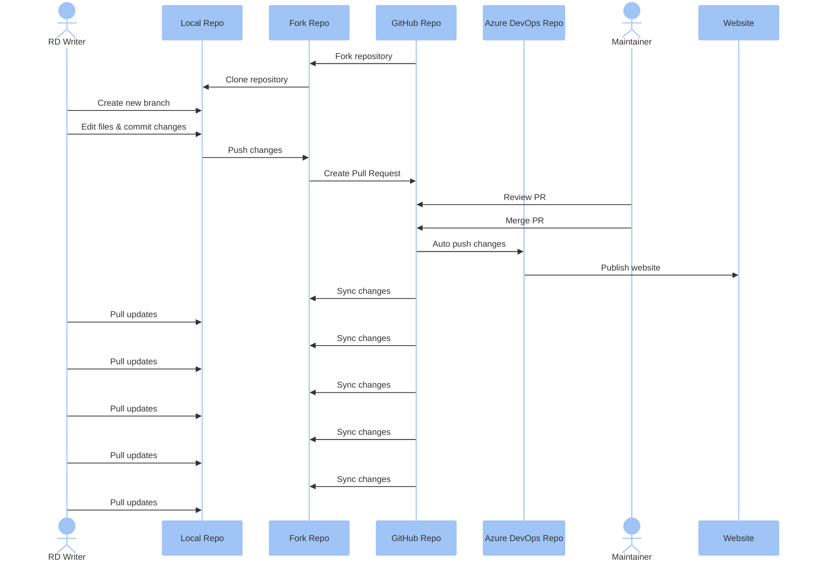

# Doc Maintenance Guide

## Overview

## 1. Getting Started

### 1.1 Required Skills
To effectively maintain BSP documentation, you should have:
- Basic knowledge of Markdown syntax
- Familiarity with Git for version control
- Ability to use a text editor for editing markdown files
- Understanding of the repository structure and how to navigate it

triggers the website publishing process.

### 1.2 Working with the GitHub Repository

#### 1.2.0 Git Workflow Overview

The following sequence diagram illustrates the Git workflow used in this documentation maintenance process, showing the interactions between different roles:



This sequence diagram shows the interaction between different roles and repositories during the document maintenance process from forking the main repository to completing the contribution cycle. After changes are merged to the main repository, they are automatically pushed to Azure DevOps Repository which then 


### 1.3 Set Up Git Environment
#### 1.3.1 Install Git
1. Download Git from the official website: [Git Downloads](https://git-scm.com/downloads)
2. Follow the installation instructions for your operating system.

#### 1.3.2 Fork the Repository
1. Go to the main repository: [Advantech-EdgeSync/DeveloperPortal](https://github.com/Advantech-EdgeSync/DeveloperPortal)
2. In the top-right corner of the page, click **Fork**.
3. Select your GitHub account as the destination for the fork.
4. Wait for the forking process to complete.

#### 1.3.3 Clone Your Forked Repository
1. Navigate to your forked repository on GitHub.
2. Click the **Code** button and copy the URL.
3. Open your terminal or command prompt.
4. Clone the repository to your local machine:
    ```sh
    git clone https://github.com/YOUR-USERNAME/DeveloperPortal.git C:/BSPMaintain
    ```
    You can change the destination folder as needed.

#### 1.3.4 Set Up Upstream Remote
1. Navigate to your local repository:
    ```sh
    cd C:/BSPMaintain
    ```
2. Add the original repository as an upstream remote:
    ```sh
    git remote add upstream https://github.com/Your-Name/DeveloperPortal.git
    ```
3. Verify the remotes:
    ```sh
    git remote -v
    ```
    You should see both the origin (your fork) and upstream (original repository).

### 1.4 Set Up Docusaurus Environment

To work with the documentation locally, you'll need to set up your development environment:

1. **Check Node.js Version**
   ```sh
   node --version
   ```
   Docusaurus requires Node.js version 16.14 or above.

   If Node.js is not installed or requires updating, download it from the official website:
   - Visit [Node.js Downloads](https://nodejs.org/en/download/)
   - Download and install the LTS (Long Term Support) version
   - Follow the installation wizard instructions for your operating system

2. **Verify NPM Installation**
   NPM (Node Package Manager) comes bundled with Node.js. Verify it's installed:
   ```sh
   npm --version
   ```

   If you need to update npm:
   ```sh
   npm install -g npm@latest
   ```

3. **Install Project Dependencies**
   Navigate to your local repository and install dependencies:
   ```sh
   cd C:/BSPMaintain
   npm install
   ```

4. **Run Docusaurus Locally**
   Start the local development server:
   ```sh
   npm run start
   ```
   This will launch the website at [http://localhost:3000](http://localhost:3000)

   You can now make changes to the documentation files, and the website will automatically refresh to reflect your changes.

5. **Build Static Website (Optional)**
   If you want to generate a production build to verify how the site will look after deployment:
   ```sh
   npm run build
   ```
   
   To view the built site locally:
   ```sh
   npm run serve
   ```
   This will serve the production build at [http://localhost:3000](http://localhost:3000)

## 2. Understanding Markdown

Markdown is a lightweight markup language with plain text formatting syntax. It allows you to create formatted text using a plain text editor and is commonly used for documentation.

### 2.1 Basic Markdown Syntax

- **Headers**: Use `#` for headers. The number of `#` symbols indicates the header level.
  ```markdown
  # Header 1
  ## Header 2
  ### Header 3
  ```

- **Emphasis**: Use `*` or `_` for emphasis.
  ```markdown
  *italic* or _italic_
  **bold** or __bold__
  ```

- **Lists**: Use `-` or `*` for unordered lists, and numbers for ordered lists.
  ```markdown
  - Item 1
  - Item 2
      - Subitem 1
      - Subitem 2

  1. First item
  2. Second item
  ```

- **Links**: Use `[text](URL)` for links.
  ```markdown
  [GitHub](https://github.com)
  ```

- **Images**: Use `` for images.
  ```markdown
  
  ```

- Admonitions
    **note**、**tip**、**info**、**caution**、**danger**
    ```markdown
    ::: note
    XXXX
    :::
    ```

### 2.2 Docusaurus Resources

For more detailed information about Markdown in Docusaurus:
- [Docusaurus Documentation](https://docusaurus.io/docs/markdown-features)
- [Docusaurus GitHub Repository](https://github.com/facebook/docusaurus)

## 3. Document Structure Guidelines

A well-structured technical document helps readers quickly find information and understand complex concepts. This section outlines the recommended structure and style for EdgeSync technical documentation.

### 3.1 General Document Structure

Each technical document should follow this general structure:

1. **Title and Metadata**
   - Clear, descriptive title
   - Appropriate sidebar position
   - Concise description for SEO

2. **What**
   - What is your product
   - What is the minimal requirement
   
3. **How**
   - How to understandard the Architecture
   - How to use you'r product

4. **Summary**
   - Recap of key points
   - Next steps or related documents

### 3.2 Best practice with article
 - Less picture.
 - Ensure the content is concise and to the point.
 - Ensure the command is smooth and sequential.

### 3.3 Review Checklist

Before submitting documentation, verify these items:

- [ ] Document follows the established structure
- [ ] All code examples are tested and working
- [ ] Links to external and internal resources are working
- [ ] Images and diagrams are clear and properly labeled
- [ ] Content is free of grammar and spelling errors
- [ ] Technical terminology is used correctly and consistently
- [ ] Prerequisites are clearly stated
- [ ] Metadata (title, description, sidebar position) is set correctly

## 4. Document Maintenance Procedures

### 4.1 Tools for Editing
You can use any text editor to edit markdown files. Some recommended options include:

- **Visual Studio Code**: A powerful, open-source code editor developed by Microsoft. It offers a wide range of features such as syntax highlighting, IntelliSense, debugging, and Git integration, making it an excellent choice for editing markdown files. [Download](https://code.visualstudio.com/)

### 4.2 Updating Existing Documents

#### 4.2.1 Sync Your Fork and Create a New Branch
1. Open your terminal or command prompt.
2. Navigate to the root directory of your local repository:
    ```sh
    cd C:/BSPMaintain
    ```
3. Ensure you're on the master branch:
    ```sh
    git checkout master
    ```
4. Sync your fork with the upstream repository:
    ```sh
    git fetch upstream
    git merge upstream/master
    git push origin master
    ```
5. Create a new branch for your changes:
    ```sh
    git checkout -b feature/productmodel/
    ```
6. Open Visual Studio Code:
    ```sh
    code .
    ```

#### 4.2.2 Edit the Document
1. In Visual Studio Code, navigate to the file you want to edit.
2. Make the necessary changes to the document.
3. Save the file by pressing `Ctrl+S` (Windows) or `Cmd+S` (Mac).

#### 4.2.3 Commit and Push Changes
1. Stage the changes:
    ```sh
    git add .
    ```
2. Commit the changes with a meaningful message:
    ```sh
    git commit -m "Updated documentation for [Product Model]"
    ```
3. Push the changes to your fork:
    ```sh
    git push origin feature/productmodel/
    ```

#### 4.2.4 Create a Pull Request to the Main Repository
1. Go to your fork on GitHub.
2. You should see a message about your recently pushed branch with a "Compare & pull request" button.
3. Click this button to create a new pull request.
4. Ensure the base repository is set to `EdgeSync-Advantech/DeveloperPortal` and the base branch is `master`.
5. Provide a descriptive title and detailed description for your PR.
6. Click "Create pull request".

After submitting the PR:
- Your PR will be reviewed by the maintainers of the main repository.
- They may request changes or approve and merge your PR.
- Once merged, your changes will be reflected on the website.

#### 4.2.5 Sync Your Fork After PR Approval
1. After your PR has been merged, switch back to your master branch:
    ```sh
    git checkout master
    ```
2. Sync your fork with the upstream repository again:
    ```sh
    git fetch upstream
    git merge upstream/master
    git push origin master
    ```
3. Delete your feature branch locally:
    ```sh
    git branch -d feature/productmodel/
    ```
4. And delete it remotely if desired:
    ```sh
    git push origin --delete feature/productmodel/
    ```

### 4.3 Adding New Documents

#### 4.3.1 Sync Your Fork and Create a New Branch
1. Open your terminal or command prompt.
2. Navigate to the root directory of your local repository:
    ```sh
    cd C:/BSPMaintain
    ```
3. Ensure you're on the master branch:
    ```sh
    git checkout master
    ```
4. Sync your fork with the upstream repository:
    ```sh
    git fetch upstream
    git merge upstream/master
    git push origin master
    ```
5. Create a new branch for your new document:
    ```sh
    git checkout -b feature/newdocument/
    ```
6. Open Visual Studio Code:
    ```sh
    code .
    ```

#### 4.3.2 Create the Necessary Folders and Files
1. In Visual Studio Code, navigate to the location where you want to add the new document.
2. Create the necessary folders for the new document, following the established folder structure.
3. Create a new markdown file for the document:
    ```sh
    touch [Product Model]/[Operating System]/[Version Number]/NewDocument.md
    ```

#### 4.3.3 Edit the New Document
1. Open the newly created markdown file in Visual Studio Code.
2. Add the content for the new document.
3. Save the file by pressing `Ctrl+S` (Windows) or `Cmd+S` (Mac).

#### 4.3.4 Commit and Push Changes
1. Stage the changes:
    ```sh
    git add .
    ```
2. Commit the changes with a meaningful message:
    ```sh
    git commit -m "Added new documentation for [Product Model]"
    ```
3. Push the changes to your fork:
    ```sh
    git push origin feature/newdocument/
    ```

#### 4.3.5 Create a Pull Request to the Main Repository
1. Go to your fork on GitHub.
2. You should see a message about your recently pushed branch with a "Compare & pull request" button.
3. Click this button to create a new pull request.
4. Ensure the base repository is set to `EdgeSync-Advantech/DeveloperPortal` and the base branch is `master`.
5. Provide a descriptive title and detailed description for your PR.
6. Click "Create pull request".

After submitting the PR:
- Your PR will be reviewed by the maintainers of the main repository.
- They may request changes or approve and merge your PR.
- Once merged, your changes will be reflected on the website.

#### 4.3.6 Sync Your Fork After PR Approval
1. After your PR has been merged, switch back to your master branch:
    ```sh
    git checkout master
    ```
2. Sync your fork with the upstream repository again:
    ```sh
    git fetch upstream
    git merge upstream/master
    git push origin master
    ```
3. Delete your feature branch locally:
    ```sh
    git branch -d feature/newdocument/
    ```
4. And delete it remotely if desired:
    ```sh
    git push origin --delete feature/ne````
wdoc````
umen````
t/
````
    `````
``
````
