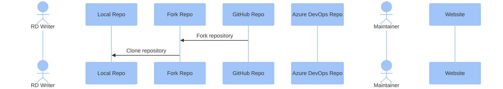

# BSP Maintenance Guide

## Overview
This document outlines the process for maintaining product BSP (Board Support Package) information through the Docusaurus platform. Maintenance is performed by editing individual markdown files according to the guidelines below. The process involves editing, adding new content, and using Git for version control to review and publish changes.

## 1. Getting Started

### 1.1 Required Skills
To effectively maintain BSP documentation, you should have:
- Basic knowledge of Markdown syntax
- Familiarity with Git for version control
- Ability to use a text editor for editing markdown files
- Understanding of the repository structure and how to navigate it

triggers the website publishing process.

### 1.2 Working with the GitHub Repository

#### 1.2.0 Git Workflow Overview

The following sequence diagram illustrates the Git workflow used in this documentation maintenance process, showing the interactions between different roles:



This sequence diagram shows the interaction between different roles and repositories during the document maintenance process from forking the main repository to completing the contribution cycle. After changes are merged to the main repository, they are automatically pushed to Azure DevOps Repository which then 

#### 1.2.1 Install Git
1. Download Git from the official website: [Git Downloads](https://git-scm.com/downloads)
2. Follow the installation instructions for your operating system.

#### 1.2.2 Fork the Repository
1. Go to the main repository: [EdgeSync-Advantech/DeveloperPortal](https://github.com/Advantech-EdgeSync/DeveloperPortal)
2. In the top-right corner of the page, click **Fork**.
3. Select your GitHub account as the destination for the fork.
4. Wait for the forking process to complete.

#### 1.2.3 Clone Your Forked Repository
1. Navigate to your forked repository on GitHub.
2. Click the **Code** button and copy the URL.
3. Open your terminal or command prompt.
4. Clone the repository to your local machine:
    ```sh
    git clone https://github.com/YOUR-USERNAME/DeveloperPortal.git C:/BSPMaintain
    ```
    You can change the destination folder as needed.

#### 1.2.4 Set Up Upstream Remote
1. Navigate to your local repository:
    ```sh
    cd C:/BSPMaintain
    ```
2. Add the original repository as an upstream remote:
    ```sh
    git remote add upstream https://github.com/EdgeSync-Advantech/DeveloperPortal.git
    ```
3. Verify the remotes:
    ```sh
    git remote -v
    ```
    You should see both the origin (your fork) and upstream (original repository).

## 2. Understanding Markdown

Markdown is a lightweight markup language with plain text formatting syntax. It allows you to create formatted text using a plain text editor and is commonly used for documentation.

### 2.1 Basic Markdown Syntax

- **Headers**: Use `#` for headers. The number of `#` symbols indicates the header level.
  ```markdown
  # Header 1
  ## Header 2
  ### Header 3
  ```

- **Emphasis**: Use `*` or `_` for emphasis.
  ```markdown
  *italic* or _italic_
  **bold** or __bold__
  ```

- **Lists**: Use `-` or `*` for unordered lists, and numbers for ordered lists.
  ```markdown
  - Item 1
  - Item 2
      - Subitem 1
      - Subitem 2

  1. First item
  2. Second item
  ```

- **Links**: Use `[text](URL)` for links.
  ```markdown
  [GitHub](https://github.com)
  ```

- **Images**: Use `` for images.
  ```markdown
  
  ```

### 2.2 Docusaurus Resources

For more detailed information about Markdown in Docusaurus:
- [Docusaurus Documentation](https://docusaurus.io/docs/markdown-features)
- [Docusaurus GitHub Repository](https://github.com/facebook/docusaurus)

## 3. Folder Structure

The BSP files are organized in a hierarchical structure as follows:

```
BSP/
├── [Product Model]/                    # Hardware product model (e.g., EPC-R7300)
│   ├── Overview.md                     # Detailed information about the device, 
                                        # including PIN descriptions, pictures, and recovery mode switch descriptions.                                        
│   ├── [Operating System]/             # OS name and version (e.g., Ubuntu 20.04)
│   │   ├── [Version Number]/           # BSP version (e.g., V1.0.1)
│   │   │   └── ReadMe.md               # Documentation for this specific version
│   │   └── [Version Number]/           # Previous BSP version (e.g., V1.0.0)
│   │       └── ...
│   └── [Operating System]/             # Another supported OS (e.g., Ubuntu 22.04)
│   │   └── ...
│   └── [assets]/                       # The static resource link in documents
│   │   └── xxx.png
│   │   └── xxx.pdf
└── [Product Model]/                    # Another hardware product (e.g., MIC-730AI)
    └── ...
```
Note:
 * A sample for Product Model Overview: [EPC-R7300](/BSP/EPC-R7300/Overview)
 * Each Sector will only maintain the contents within the BSP folder. 
 * Please do not modify any other files. 
 * Additionally, only add or modify products under your own Sector. 
 * There will be a review mechanism before the final release and the changes will be published to the website only after approval.

## 4. Document Maintenance Procedures

### 4.1 Tools for Editing
You can use any text editor to edit markdown files. Some recommended options include:

- **Visual Studio Code**: A powerful, open-source code editor developed by Microsoft. It offers a wide range of features such as syntax highlighting, IntelliSense, debugging, and Git integration, making it an excellent choice for editing markdown files. [Download](https://code.visualstudio.com/)

### 4.2 Updating Existing Documents

#### 4.2.1 Sync Your Fork and Create a New Branch
1. Open your terminal or command prompt.
2. Navigate to the root directory of your local repository:
    ```sh
    cd C:/BSPMaintain
    ```
3. Ensure you're on the master branch:
    ```sh
    git checkout master
    ```
4. Sync your fork with the upstream repository:
    ```sh
    git fetch upstream
    git merge upstream/master
    git push origin master
    ```
5. Create a new branch for your changes:
    ```sh
    git checkout -b feature/productmodel/
    ```
6. Open Visual Studio Code:
    ```sh
    code .
    ```

#### 4.2.2 Edit the Document
1. In Visual Studio Code, navigate to the file you want to edit.
2. Make the necessary changes to the document.
3. Save the file by pressing `Ctrl+S` (Windows) or `Cmd+S` (Mac).

#### 4.2.3 Commit and Push Changes
1. Stage the changes:
    ```sh
    git add .
    ```
2. Commit the changes with a meaningful message:
    ```sh
    git commit -m "Updated documentation for [Product Model]"
    ```
3. Push the changes to your fork:
    ```sh
    git push origin feature/productmodel/
    ```

#### 4.2.4 Create a Pull Request to the Main Repository
1. Go to your fork on GitHub.
2. You should see a message about your recently pushed branch with a "Compare & pull request" button.
3. Click this button to create a new pull request.
4. Ensure the base repository is set to `EdgeSync-Advantech/DeveloperPortal` and the base branch is `master`.
5. Provide a descriptive title and detailed description for your PR.
6. Click "Create pull request".

After submitting the PR:
- Your PR will be reviewed by the maintainers of the main repository.
- They may request changes or approve and merge your PR.
- Once merged, your changes will be reflected on the website.

#### 4.2.5 Sync Your Fork After PR Approval
1. After your PR has been merged, switch back to your master branch:
    ```sh
    git checkout master
    ```
2. Sync your fork with the upstream repository again:
    ```sh
    git fetch upstream
    git merge upstream/master
    git push origin master
    ```
3. Delete your feature branch locally:
    ```sh
    git branch -d feature/productmodel/
    ```
4. And delete it remotely if desired:
    ```sh
    git push origin --delete feature/productmodel/
    ```

### 4.3 Adding New Documents

#### 4.3.1 Sync Your Fork and Create a New Branch
1. Open your terminal or command prompt.
2. Navigate to the root directory of your local repository:
    ```sh
    cd C:/BSPMaintain
    ```
3. Ensure you're on the master branch:
    ```sh
    git checkout master
    ```
4. Sync your fork with the upstream repository:
    ```sh
    git fetch upstream
    git merge upstream/master
    git push origin master
    ```
5. Create a new branch for your new document:
    ```sh
    git checkout -b feature/newdocument/
    ```
6. Open Visual Studio Code:
    ```sh
    code .
    ```

#### 4.3.2 Create the Necessary Folders and Files
1. In Visual Studio Code, navigate to the location where you want to add the new document.
2. Create the necessary folders for the new document, following the established folder structure.
3. Create a new markdown file for the document:
    ```sh
    touch [Product Model]/[Operating System]/[Version Number]/NewDocument.md
    ```

#### 4.3.3 Edit the New Document
1. Open the newly created markdown file in Visual Studio Code.
2. Add the content for the new document.
3. Save the file by pressing `Ctrl+S` (Windows) or `Cmd+S` (Mac).

#### 4.3.4 Commit and Push Changes
1. Stage the changes:
    ```sh
    git add .
    ```
2. Commit the changes with a meaningful message:
    ```sh
    git commit -m "Added new documentation for [Product Model]"
    ```
3. Push the changes to your fork:
    ```sh
    git push origin feature/newdocument/
    ```

#### 4.3.5 Create a Pull Request to the Main Repository
1. Go to your fork on GitHub.
2. You should see a message about your recently pushed branch with a "Compare & pull request" button.
3. Click this button to create a new pull request.
4. Ensure the base repository is set to `EdgeSync-Advantech/DeveloperPortal` and the base branch is `master`.
5. Provide a descriptive title and detailed description for your PR.
6. Click "Create pull request".

After submitting the PR:
- Your PR will be reviewed by the maintainers of the main repository.
- They may request changes or approve and merge your PR.
- Once merged, your changes will be reflected on the website.

#### 4.3.6 Sync Your Fork After PR Approval
1. After your PR has been merged, switch back to your master branch:
    ```sh
    git checkout master
    ```
2. Sync your fork with the upstream repository again:
    ```sh
    git fetch upstream
    git merge upstream/master
    git push origin master
    ```
3. Delete your feature branch locally:
    ```sh
    git branch -d feature/newdocument/
    ```
4. And delete it remotely if desired:
    ```sh
    git push origin --delete feature/newdocument/
    ```

## 5. Overview.md Content Structure Guidelines

The Overview.md file is a critical document that provides detailed information about a hardware product. It serves as the main reference for users and developers to understand the device's features, specifications, and how to interact with it. Based on the EPC-R7300 example, here is the recommended structure for an Overview.md file:

### 5.1 Overview Section    (Require)

The first content section should provide a general overview of the product:

- Brief description of the product and its primary use case
- Key features in bullet point format
- Performance specifications
- Hardware capabilities
- Expansion options
- Target applications or industry focus

Example:
```markdown
## Overview
[Product Model], An industrial [product type] for the [platform/architecture] delivers [performance metrics].

- Key Feature 1
- Key Feature 2
- Key Feature 3
...
```

### 5.2 Device interface Definitions (Require)

Document all external connectors and their pin assignments:

- Group by connector type (DC-In, USB, LAN, HDMI, etc.)
- Include clear descriptions of each port's capabilities (version, speed, resolution support)
- Provide pin diagrams or images of the connectors
- Use tables to display pin mappings with pin numbers and signal names
- Include LED indicator descriptions if applicable

Example for each connector:
```markdown
### [Connector Name]
[Product Model] supports [number] [connector type] that [brief description of capabilities]


| Pin | Pin Name | Pin | Pin Name |
|-----|----------|-----|----------|
| 1   | Signal 1 | 2   | Signal 2 |
...
```

### 5.3 Debug Information (Require)

Include detailed instructions for debugging the device:

- Debug port location and pin definitions
- Required debug cables and part numbers
- Step-by-step instructions for connecting to the device
- Terminal/console settings (baud rate, parity, etc.)
- Screenshots of configuration for common terminal programs
- Default login credentials

### 5.4 Recovery Mode Instructions (Option)

If the device has a recovery mode or special boot modes, document:

- Physical switch locations or jumper settings
- Steps to enter different boot modes
- Visual indicators of successful mode entry
- Common recovery procedures

### 5.5 Additional Resources (Option)

Include references to:

- Related documentation
- Development tools
- Support contacts
- Links to software downloads

### 5.6 Guidelines for Images and Assets

- Store all images in an `assets` subfolder within the product folder
- Use descriptive filenames for images
- Keep image sizes reasonable for web viewing (compress if necessary)
- Include diagrams for complex pin layouts or configurations
- Use screenshots for software configuration steps

Following this structure ensures consistency across product documentation and provides users with the necessary information to effectively work with the hardware.

## 6. BSP Version readme.md Content Structure Guidelines

The readme.md file within each BSP version folder provides crucial information about that specific BSP release, including installation instructions, features, and updates. Based on the EPC-R7300 example, here is the recommended structure for a readme.md file:

### 6.1 Header Information (Required)

Start with proper front matter for Docusaurus:

```markdown
---
sidebar_label: 'V1.0.0'
hide_title: true
title: [Product Model] BSP Image V1.0.0 ([OS Name])
tags: 
   - [Product Model] 
   - [Platform]
   - BSP Image
---
```

### 6.2 Download Information (Required)

Provide a clear, prominent link to download the BSP image and include verification information:

```markdown
:::tip [Download The BSP Image Here](link-to-download)
MD5： `md5-hash-value`
<br/>Version： [Version Type]
:::
```

### 6.3 Overview Section (Required)

Include basic release information:

- Release date
- Supported products
- Any general notes about the release

### 6.4 Comment/Update Section (Required)

Document all changes in the current version using a numbered table:

```markdown
### Update
| No. | Description |
|-----|-------------|
| 1   | Change 1    |
| 2   | Change 2    |
```

### 6.5 Features Section (Required)

List all component versions and specifications in a table format:

```markdown
## Features

| Component       | Version                |
|-----------------|------------------------|
| SOM             | [SOM details]          |
| OS version      | [OS version]           |
| Kernel version  | [Kernel version]       |
| [Other components and versions...]       |
```

### 6.6 Installation Instructions (Required)

Provide detailed, step-by-step instructions for installing the BSP:

1. **Device Connection**
   - Include a diagram showing how to connect devices
   - Use Mermaid diagrams when possible

2. **Entering Recovery Mode**
   - Document all available methods
   - Include visual indicators for successful mode entry

3. **Flash BSP Steps**
   - Provide exact commands to run
   - Use code blocks for commands
   - Include expected outputs where helpful
   - Document any special configurations or options

### 6.7 Test Report (Optional)

If available, include:
- Test results
- Test environment details
- Performance metrics
- Known issues and workarounds

### 6.8 Guidelines for Code Blocks

- Use triple backticks with language specification for code blocks
- Include comments in code blocks to explain complex commands
- Use proper indentation for readability

### 6.9 Guidelines for Diagrams

- Use Mermaid diagrams for connections and workflows
- Keep diagrams simple and focused on essential information
- Include clear labels for all components

Following this structure ensures consistency across BSP documentation and provides users with the necessary information to effectively install and use the BSP for their hardware.


