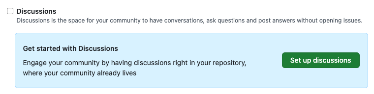
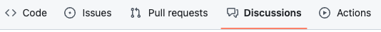
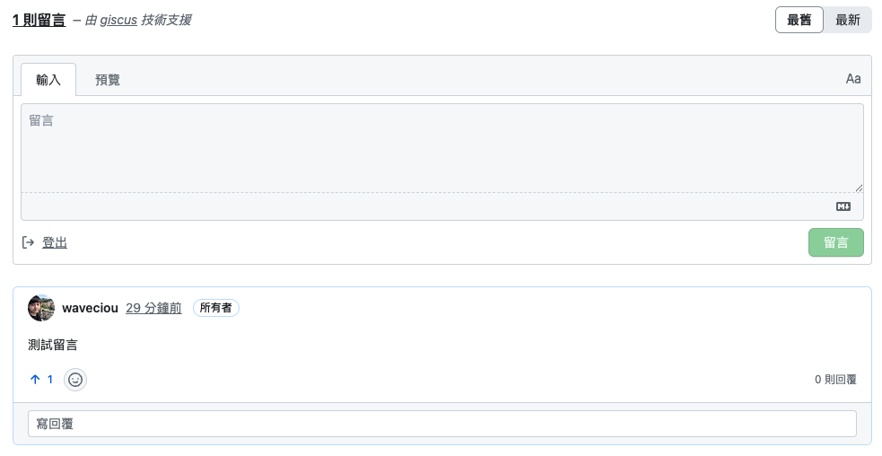
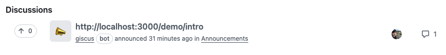

# 使用 Giscus 與 GitHub Discussion

:::tip **參考文件**
https://jimhuang.dev/docusaurus/giscus/
:::

## 在 Docusaurus 建立 Component

使用 Docusaurus Swizzling 的功能將 Layout Component 拆分出來

```bash
# 載入 Docusaurus Swizzling
npm run swizzle
```

依照順序選擇下列選項

```bash
> @docusaurus/theme-classic
> DocItem/Layout
> Eject
```

接著就會產生 Layout Component 的檔案

```markdown
website
└── src
    └── theme
        └── DocItem
            └── Layout
                ├── index.js
                └── styles.module.css
```

## 設定 GitHub Discussion

開啟你的 GitHub Repo 頁面，接著到 Settings > General > Features 打開 Discussions 選項

:::tip

:::

在 Repo 主頁面就會出現 Discussions 頁面

:::tip

:::

## Giscus 設定

1. 前往 [Giscus](https://github.com/apps/giscus) 頁面，連接你的 GitHub Repo
2. 連接完畢後，接著到 [Giscus](https://giscus.app/zh-TW) 設定其選項
3. 設定完成後會產生一個 Script 標籤

```html
<script
  src="https://giscus.app/client.js"
  data-repo="[在此輸入儲存庫名稱]"
  data-repo-id="[在此輸入儲存庫 ID]"
  data-category="[在此輸入分類名稱]"
  data-category-id="[在此輸入分類 ID]"
  data-mapping="pathname"
  data-strict="0"
  data-reactions-enabled="1"
  data-emit-metadata="0"
  data-input-position="bottom"
  data-theme="preferred_color_scheme"
  data-lang="zh-TW"
  crossorigin="anonymous"
  async>
</script>
```

## 在專案中載入 Giscus 元件

在終端機輸入指令，安裝 Giscus React

```bash
# 安裝 Giscus React
npm i @giscus/react
```

接著到 `src/theme/DocItem/Layout/index.js` ，在 Layout Component 置入 Giscus 元件

```jsx
/* src/theme/DocItem/Layout/index.js */

import Giscus from "@giscus/react";
import { useColorMode } from "@docusaurus/theme-common";

export default function DocItemLayout({children}) {
  const docTOC = useDocTOC();
  const {metadata} = useDoc();
  const { colorMode } = useColorMode();
  return (
    <div className="row">
      <div className={clsx('col', !docTOC.hidden && styles.docItemCol)}>
        <ContentVisibility metadata={metadata} />
        <DocVersionBanner />
        <div className={styles.docItemContainer}>
          <article>
            <DocBreadcrumbs />
            <DocVersionBadge />
            {docTOC.mobile}
            <DocItemContent>{children}</DocItemContent>
            <DocItemFooter />
          </article>
          <DocItemPaginator />
          {/* 置入 Giscus 元件 */}
          <Giscus
            id='comments'
            repo='[在此輸入儲存庫名稱]'
            repoId='[在此輸入儲存庫 ID]'
            category='[在此輸入分類名稱]'
            categoryId='[在此輸入分類 ID]'
            mapping='url'
            reactionsEnabled='1'
            emitMetadata='0'
            inputPosition='top'
            theme={colorMode}
            lang='zh-TW'
            loading='lazy'
          />
        </div>
      </div>
      {docTOC.desktop && <div className="col col--3">{docTOC.desktop}</div>}
    </div>
  );
}
```

設定完成後重新開啟專案，就可以看到 GitHub Discussion 留言區了

:::tip

:::

留言在 GitHub Repo 的 Discussion 裡也都可以看到

:::tip

:::